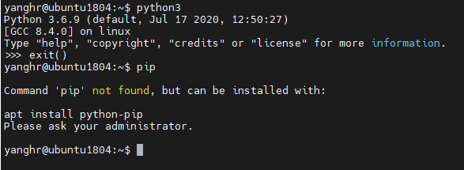
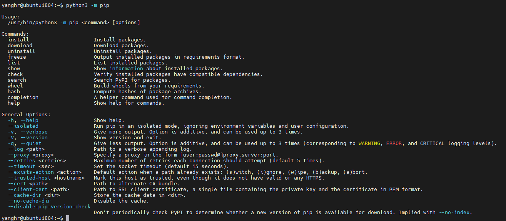
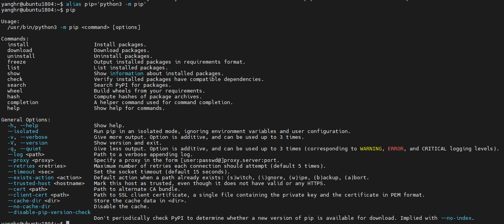

## 1. pip报错

如图所示，安装python3后可以正常使用，但是使用pip命令会出现错误:



按照报错提示执行 `apt install python-python` 以及 `apt install python3-pip` 后依然无法解决该问题。

## 2. 解决方法

如果遇到 `pip` 命令无法执行，那么很大概率是环境变量配置出现问题，可以执行 `python -m pip` 命令查看执行情况：



执行成功，可以看出并不是python安装的问题，仅执行 `pip` 命令无法调用python的pip模块。

如果想要直接使用 `pip` 命令，可以执行Linux提供的 `alias` 命令，将 `python -m pip` 命令重命名为 `pip` 。

alias命令使用方式如下：

```shell
alias [别名]=[需要别名的命令] 
# 注意，等号两边不要空格，若命令包含空格，则一定要加''
```

使用 `alias pip='python -m pip'` 即可设置命令别名为 `pip` ， 结果如下所示：



可以看到，执行别名命令后，pip就可以正常使用了。

 