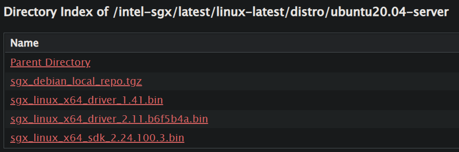

## 一、检测硬件是否支持Intel SGX

1. 下载检测文件：

   ```shell
   git clone https://github.com/ayeks/SGX-hardware && cd SGX-hardware
   ```

2. 编译：

   ```shell
   make
   ```

3. 执行：

   ```
   ./test-sgx
   ```

   如果输出如下结果，则表示支持SGX：

   ```shell
   Supports SGX
   SGX Launch Configuration (SGX_LC): 1
   SGX Attestation Services (SGX_KEYS): 0
   SGX1 leaf instructions (SGX1): 0
   SGX2 leaf instructions (SGX2): 0
   ```

   

## 二、安装驱动程序

1. 将该下载地址的3个.bin文件下载下来，下载地址：https://download.01.org/intel-sgx/latest/linux-latest/distro/ubuntu20.04-server/

   

   ```shell
   wget https://download.01.org/intel-sgx/latest/linux-latest/distro/ubuntu20.04-server/*.bin
   ```

2. 在下载文件夹下输入下面命令，赋予.bin文件的执行权限：

   ```shell
   chmod 777 sgx_linux_x64_driver_2.11.b6f5b4a.bin
   ```

3. 运行该.bin文件，完成驱动程序安装：

   ```shell
   ./sgx_linux_x64_driver_2.11.b6f5b4a.bin
   ```

   

## 三、准备阶段

1. 安装编译SGX SDK要用到的工具：

   ```shell
   sudo apt-get install build-essential ocaml ocamlbuild automake autoconf libtool wget python-is-python3 libssl-dev git cmake perl
   ```

2. 安装编译SGX PSW要用到的工具：

   ```shell
   sudo apt-get install libssl-dev libcurl4-openssl-dev protobuf-compiler libprotobuf-dev debhelper cmake reprepro unzip pkgconf libboost-dev libboost-system-dev protobuf-c-compiler libprotobuf-c-dev lsb-release
   ```

3. 从仓库获取源码，到下载文件夹下，输入：

   ```shell
   git clone https://github.com/intel/linux-sgx.git
   cd linux-sgx && make preparation
   ```

   在执行 `make preparation`命令时可能会因为网络原因失败，多次执行后一般都会成功。

4. 把准备好的工具列表添加到全局变量中，方便之后编译工作的展开。到linux-sgx文件夹下，输入以下命令：

   ```shell
   sudo cp external/toolset/{current_distr}/* /usr/local/bin
   ```

   将`current_distr` 替换成当前的操作系统，当前操作系统为ubuntu20.04：

   

   用下面语句检查工具是否添加成功：

   ```shell
   which as ld objdump
   ```

   如果输出结果如下表示添加成功：

   ```shell
   /usr/bin/as
   /usr/bin/ld
   /usr/bin/objdump
   ```

5. 编译SGX SDK和SGX SDK安装工具(installer)，进入linux-sgx文件夹，输入以下命令:

   ```shell
   make sdk
   ```

   运行完成后，再输入以下命令：

   ```shell
   make sdk_install_pkg
   ```

   成功运行的话，在linux-sgx/linux/installer/bin文件夹下会有一个sgx_linux_x64_sdk_${version}.bin文件生成。
   
   

## 四、SGX SDK安装

1. 安装sdk，进入linux-sgx文件夹，输入以下两条命令：

   ```shell
   cd linux/installer/bin
   ./sgx_linux_x64_sdk_${version}.bin
   ```

   注意，运行第二条命令时，它询问是否安装在当前文件夹的时候，最好选择“no”，然后输入/opt/intel/, 即将SGX SDK安装在/opt/intel/文件夹下。

2. 安装完成后，根据提示输入source命令


## 五、SGX PSW安装

因为现在SGX程序运行时使用的是SGX PSW中的libsgx-urts动态库，所以需要安装PSW，否则飞地无法正常启动。

1. 命令行运行以下命令添加下载Intel sgx psw的下载路径:

   ```shell
   echo 'deb [arch=amd64] https://download.01.org/intel-sgx/sgx_repo/ubuntu focal main' | sudo tee /etc/apt/sources.list.d/intel-sgx.list
   ```

   注意，ubuntu20.04系统的别称为focal。

2. 进入如下网址下载密钥intel-sgx-deb.key，https://download.01.org/intel-sgx/sgx_repo/ubuntu/：

   ```shell
   wget https://download.01.org/intel-sgx/sgx_repo/ubuntu/intel-sgx-deb.key
   ```

3. 进入下载目录，通过如下命令添加进仓库：

   ```shell
   sudo apt-key add intel-sgx-deb.key
   ```
   运行后等一会儿看到【ok】就是运行成功。

4. 更新一下apt-get列表：

   ```shell
   sudo apt-get update
   ```

5. 分别安装SGX PSW 提供的3个服务，分别是launch、EPID-based attestation和Algorithm agnostic attestation，输入以下命令：

   ```shell
   sudo apt-get install libsgx-launch libsgx-urts
   sudo apt-get install libsgx-epid libsgx-urts
   sudo apt-get install libsgx-quote-ex libsgx-urts
   sudo apt-get install libsgx-dcap-ql
   ```


## 六、测试是否安装成功

进入安装目录（我的是/opt/intel/sgxsdk），再进入/SampleCode/SampleEnclave目录

1. 首先准备一下编译环境，输入如下命令:

   ```shell
   source /opt/intel/sgxsdk/environment
   ```

2. 编译

   ```shell
   cd /opt/intel/sgxsdk/SampleCode/SampleEnclave && make
   ```

3. 运行

   ```shell
   ./app
   ```

   结果返回如下：

   ```shell
   Checksum(0x0x7ffda4d55720, 100) = 0xfffd4143
   Info: executing thread synchronization, please wait...
   Info: SampleEnclave successfully returned.
   Enter a character before exit ...
   ```

   到这里环境配置就成功了


## 七、配置secGear环境

请听下回分解！