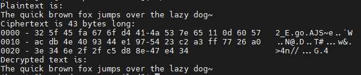

AES128-CTR方式，属于对称加密的一种，之前的博客里有讲过加密的过程。

使用OpenSSL实现的示例代码：

```c++
#include <stdlib.h>
#include <stdio.h>
#include <string.h>
#include <openssl/evp.h>
#include <openssl/bio.h>

#define SSL_CTR_BITS	128
#define SHIFT_BYTE	8

int decryptedtext_len, ciphertext_len;

/*
* 计数器自增函数
*/
static void ctr128_inc(unsigned char *counter)
{
	unsigned int n = 16, c = 1;

	do {
		--n;
		c += counter[n];
		counter[n] = (unsigned char)c;
		c >>= SHIFT_BYTE;
	} while (n);
}

/* AES-CTR 128-bit 加密
 * @param p_key 加密密钥
 * @param p_src 明文
 * @param src_len 明文长度
 * @param p_ctr 计数器指针
 * @param ctr_inc_bits 计数器位数
 * @param p_dst 密文
 * @return ret 是否执行成功
 */
int aes_ctr_encrypt(const uint8_t *p_key, const uint8_t *p_src,
                                const uint32_t src_len, uint8_t *p_ctr, const uint32_t ctr_inc_bits,
                                uint8_t *p_dst)
{
	
	if ((src_len > INT_MAX) || (p_key == NULL) || (p_src == NULL) || (p_ctr == NULL) || (p_dst == NULL)) {
		return -1;
	}

	/* 基于openSSL实现加密 */
	int ret = -1;
	int len = 0;
	EVP_CIPHER_CTX* ptr_ctx = NULL;

	// OpenSSL假设计数器是IV的低位部分
	if (ctr_inc_bits != SSL_CTR_BITS) {
		return ret;
	}

	do {
		// 创建并初始化 ctx
		if (!(ptr_ctx = EVP_CIPHER_CTX_new())) {
			ret = -1;
			break;
		}

		// 初始化加密、密钥
		if (1 != EVP_EncryptInit_ex(ptr_ctx, EVP_aes_128_ctr(), NULL, (unsigned char*)p_key, p_ctr)) {
			break;
		}

		// 提供需要加密的明文并获取密文
		if (1 != EVP_EncryptUpdate(ptr_ctx, p_dst, &len, p_src, src_len)) {
			break;
		}

		// 结束加密过程
		if (1 != EVP_EncryptFinal_ex(ptr_ctx, p_dst + len, &len)) {
			break;
		}

		// 加密成功，计数器自增
		len = src_len;
        ciphertext_len = len;
		while (len >= 0) {
			ctr128_inc(p_ctr);
			len -= 16;
		}
		ret = 0;
	} while (0);

	// 清空并释放ctx
	//
	if (ptr_ctx) {
		EVP_CIPHER_CTX_free(ptr_ctx);
	}
	return ret;
}

/* AES-CTR 128-bit 加密
 * @param p_key 加密密钥
 * @param p_src 密文
 * @param src_len 密文长度
 * @param p_ctr 计数器指针
 * @param ctr_inc_bits 计数器位数
 * @param p_dst 明文
 * @return ret 是否执行成功
 */

sgx_status_t aes_ctr_decrypt(const sgx_aes_ctr_128bit_key_t *p_key, const uint8_t *p_src,
                                const uint32_t src_len, uint8_t *p_ctr, const uint32_t ctr_inc_bits,
                                uint8_t *p_dst)
{

	if ((src_len > INT_MAX) || (p_key == NULL) || (p_src == NULL) || (p_ctr == NULL) || (p_dst == NULL)) {
		return -1;
	}

	/* 基于OpenSSL实现解密 */
	int ret = -1;
	int len = 0;
	EVP_CIPHER_CTX* ptr_ctx = NULL;

	// OpenSSL假设计数器是IV的低位部分
	if (ctr_inc_bits != SSL_CTR_BITS) {
		return -1;
	}

	do {
		// 创建并初始化ctx
		if (!(ptr_ctx = EVP_CIPHER_CTX_new())) {
			ret = SGX_ERROR_OUT_OF_MEMORY;
			break;
		}

		// 初始化解密、密钥和CTR
		if (!EVP_DecryptInit_ex(ptr_ctx, EVP_aes_128_ctr(), NULL, (unsigned char*)p_key, p_ctr)) {
			break;
		}

		// 解密并获取明文输出
		if (!EVP_DecryptUpdate(ptr_ctx, p_dst, &len, p_src, src_len)) {
			break;
		}

		// 结束解密过程
		if (EVP_DecryptFinal_ex(ptr_ctx, p_dst + len, &len) <= 0) { // same notes as above - you can't write beyond src_len
			break;
		}
        
		// 计数器自增 
		len = src_len;
        decryptedtext_len = len;
		while (len >= 0) {
			ctr128_inc(p_ctr);
			len -= 16;
		}
		ret = 0;
	} while (0);

	// 清空并释放ctx
	if (ptr_ctx) {
		EVP_CIPHER_CTX_free(ptr_ctx);
	}
	return ret;
}

int main(int argc, char const *argv[])
{
    /* 128 bit 密钥 */
    unsigned char *key = (unsigned char *)"0123456789012345";

    /* 128 bit IV */
    unsigned char *iv = (unsigned char *)"0123456789012345";

    /* 需要加密的消息 */
    unsigned char *plaintext = "The quick brown fox jumps over the lazy dog";

    /* 
     * 密文缓冲区
     */
    unsigned char ciphertext[128];

    /* 解密后的明文缓冲区 */
    unsigned char decryptedtext[128];

    cout << "Plaintext: " << plaintext << endl;

    /* 加密明文 */
    aex_ctr_encrypt(key, plaintext, strlen(plaintext), key, iv, 128, ciphertext);

    /* 查看加密结果 */
    cout << "密文长度: " << ciphertext_len << endl;
    BIO_dump_fp(stdout, ciphertext, ciphertext_len);
    
    /* 解密密文 */
    aex_ctr_decrypt(key, ciphertext, ciphertext_len, key, iv, 128, decryptedtext);

    /* 加上空字符 */
    decryptedtext[decryptedtext_len] = '\0';

    /* 显示解密结果 */
    printf("Decrypted text is:\n");
    cout << "Decrypted text: " << decryptedtext << endl;

    return 0;
}
```


运行结果：

