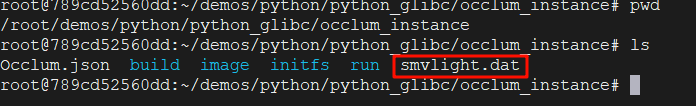

机密计算底层依赖的可信执行环境（TEE）技术——比如目前最成熟的云端 TEE 技术 Intel SGX——也带来了额外的功能限制和兼容问题。这使得机密计算的开发者面领一个巨大的阻碍：应用开发难。

Occlum 是一款蚂蚁集团开源的 TEE OS，可以大幅降低 SGX 应用的开发门槛。具体的操作流程如下：

### 1. 拉取并启动镜像

第一步，检查环境是否提供SGX硬件支持，这个在之前系列的文章中已经有过介绍， 操作十分简单。

第二步，拉取Occlum镜像，命令如下

```shell
docker pull occlum/occlum:[version]-ubuntu20.04
```

我使用的是0.29.0版本，命令如下：

```shell
docker pull occlum/occlum:0.29.0-ubuntu20.04
```

第三步，运行Occlum镜像，命令如下：

```shell
# 1.在主机上创建软链接
mkdir -p /dev/sgx
ln -sf /dev/sgx_enclave /dev/sgx/enclave
ln -sf /dev/sgx_provision /dev/sgx/provision

# 2.以两种方式启动镜像
# (1).特权模式
docker run -it --privileged -v /dev/sgx:/dev/sgx occlum/occlum:[version]-ubuntu20.04

# (2).非特权模式
docker run -it --device /dev/sgx/enclave --device /dev/sgx/provision occlum/occlum:[version]-ubuntu20.04
```

注意，使用的时候把 `[version]` 整个替换成所用的Occlum版本，，比如我使用的是0.29.0这个版本，以特权模式启动镜像，命令如下：

```shell
docker run -it --privileged -v /dev/sgx:/dev/sgx occlum/occlum:0.29.0-ubuntu20.04
```

进入容器后，需要验证SGX是否正常工作，

```
cd /opt/intel/sgxsdk/SampleCode/SampleEnclave && make && ./app
```

若工作正常，说明Occlum容器可正常使用sgxsdk，可以进行下一步操作。

### 2. 运行demo程序

进入镜像后，demos文件夹存放在root文件夹下，路径为`/root/demos`, 接下来我们以hello_world为例，说明demo程序的编译、构建过程。

第一步，进入hello_world文件夹，使用occlum-gcc编译链编译源文件

```shell
cd /root/demos/hello_c
occlum-gcc -o hello_world hello_world.c
```

编译成功后，此时hello_world程序是可以正常运行的，可以检查是否编译成功：

```shell
./hello_world
```

第二步，初始化Occlum实例：

```shell
occlum new occlum_instance
```

这时会在当前文件夹下生成occlum_instance文件夹，文件夹中存放的是构建镜像所需的最小文件系统和一个Occlum.json文件，其中可以修改Enclave的堆栈内存布局参数，可以根据程序需要修改。

第三步，生成Occlum安全FS镜像和Occlum Enclave：

```shell
cd occlum_instance
cp ../hello_world image/bin
occlum build
```

最后，执行如下命令运行可信应用程序：

```shell
occlum run /bin/hello_world
```

如果输出`Hello World!` ，则说明构建成功。

### 3.运行Python Demo程序

这里用0.29.0-0.29.4卡了很长时间，最后排查无果后换成了`docker pull occlum/occlum:latest-ubuntu20.04`这个tag的镜像，经测试可以正常使用。

对于python程序，我们要进入demos目录下的python_glibc目录：

```shell
cd /root/demos/python/python_glibc
```

这里官方已经提供了一键安装、运行脚本，感兴趣的朋友可以自行研究。

首先安装python所需环境和依赖：

```shell
./install_python_with_conda.sh
```

这一步一定要看到conda安装依赖才算成功，这个脚本具体内容如下：

```shell
#!/bin/bash
set -e
script_dir="$( cd "$( dirname "${BASH_SOURCE[0]}"  )" >/dev/null 2>&1 && pwd )"

# 1. Init occlum workspace
[ -d occlum_instance ] || occlum new occlum_instance

# 2. Install python and dependencies to specified position
[ -d Miniconda3-latest-Linux-x86_64.sh ] || wget https://repo.anaconda.com/miniconda/Miniconda3-latest-Linux-x86_64.sh
[ -d miniconda ] || bash ./Miniconda3-latest-Linux-x86_64.sh -b -p $script_dir/miniconda
$script_dir/miniconda/bin/conda create --prefix $script_dir/python-occlum -y python=3.7 numpy=1.18.1 pandas=0.24.2 scipy=1.3.1 Cython scikit-learn=0.21.1
```

如果是第一次运行，系统会提示要accept conda的源，这里需要在脚本里加上这两句（加在miniconda安装成功之后）：

```shell
# 2.5 Accept Anaconda Terms of Service (non-interactive)
$script_dir/miniconda/bin/conda tos accept --override-channels --channel https://repo.anaconda.com/pkgs/main
$script_dir/miniconda/bin/conda tos accept --override-channels --channel https://repo.anaconda.com/pkgs/r
```

安装成功之后，运行第二个脚本：

```shell
./run_python_on_occlum.sh
```

脚本内容：

```shell
#!/bin/bash
set -e

BLUE='\033[1;34m'
NC='\033[0m'

script_dir="$( cd "$( dirname "${BASH_SOURCE[0]}"  )" >/dev/null 2>&1 && pwd )"
python_dir="$script_dir/occlum_instance/image/opt/python-occlum"

cd occlum_instance && rm -rf image
copy_bom -f ../pytorch.yaml --root image --include-dir /opt/occlum/etc/template

if [ ! -d $python_dir ];then
    echo "Error: cannot stat '$python_dir' directory"
    exit 1
fi

new_json="$(jq '.resource_limits.user_space_size = "1MB" |
                .resource_limits.user_space_max_size = "6000MB" |
                .resource_limits.kernel_space_heap_size = "1MB" |
                .resource_limits.kernel_space_heap_max_size = "256MB" |
                .resource_limits.max_num_of_threads = 64 |
                .env.default += ["PYTHONHOME=/opt/python-occlum"]' Occlum.json)" && \
echo "${new_json}" > Occlum.json
occlum build

# Run the python demo
echo -e "${BLUE}occlum run /bin/python3 demo.py${NC}"
occlum run /bin/python3 demo.py
```

这里如果没有SGX硬件环境，可以使用模拟方式来创建occlum环境：

```shell
occlum build --sgx-mode SIM
```

这个脚本是在初始化occlum环境和构建镜像，可能需要1-2分钟，如果超过5分钟还没有反应，基本上可以确定出错了。这个确实不好排查，我看github上有个老哥说可以这样运行脚本：

```shell
OCCLUM_LOG_LEVEL=trace ./run_python_on_occlum.sh
```

但是这个需要一步一步排查日志输出，我在0.29.0卡了很长时间，卡出来过一次报错信息，没保存下来，之后一直想复现也没卡出来，直接换latest 这个tag的镜像。

出现以下输出后，说明运行成功：

```shell
Enclave sign-tool: /opt/occlum/sgxsdk-tools/bin/x64/sgx_sign
Enclave sign-key: /opt/occlum/etc/template/Enclave.pem
SGX mode: HW
Building new image...
[+] Home dir is /root
[+] Open token file success!
[+] Token file valid!
[+] Init Enclave Successful 5785320947714!
Generate the SEFS image successfully
Build on platform WITHOUT EDMM support
Building libOS...
Signing the enclave...
<EnclaveConfiguration>
    <ProdID>0</ProdID>
    <ISVSVN>0</ISVSVN>
    <StackMaxSize>1048576</StackMaxSize>
    <StackMinSize>1048576</StackMinSize>
    <HeapInitSize>314572800</HeapInitSize>
    <HeapMaxSize>314572800</HeapMaxSize>
    <HeapMinSize>314572800</HeapMinSize>
    <TCSNum>32</TCSNum>
    <TCSMaxNum>32</TCSMaxNum>
    <TCSMinPool>32</TCSMinPool>
    <TCSPolicy>0</TCSPolicy>
    <DisableDebug>0</DisableDebug>
    <MiscSelect>0</MiscSelect>
    <MiscMask>0</MiscMask>
    <ReservedMemMaxSize>671088640</ReservedMemMaxSize>
    <ReservedMemMinSize>671088640</ReservedMemMinSize>
    <ReservedMemInitSize>671088640</ReservedMemInitSize>
    <ReservedMemExecutable>1</ReservedMemExecutable>
    <EnableKSS>0</EnableKSS>
    <ISVEXTPRODID_H>0</ISVEXTPRODID_H>
    <ISVEXTPRODID_L>0</ISVEXTPRODID_L>
    <ISVFAMILYID_H>0</ISVFAMILYID_H>
    <ISVFAMILYID_L>0</ISVFAMILYID_L>
    <PKRU>0</PKRU>
    <AMX>0</AMX>
</EnclaveConfiguration>
tcs_num 32, tcs_max_num 32, tcs_min_pool 32
INFO: SGX1 only enclave, which will run on all platforms.
The required memory is 1026314240B.
The required memory is 0x3d2c5000, 1002260 KB.
handle_compatible_metadata: Overwrite with metadata version 0x100000004
Succeed.
Built the Occlum image and enclave successfully
occlum run /bin/python3 demo.py
```

这个demo运行成功之后，会在 `occlum_instance` 目录下生成 `smvlight.dat` 文件



到这一步就彻底运行成功了。

从 `install_python_with_conda.sh` 中可以看到这个python环境中已经安装了 `numpy`，`pandas`，`scipy`，`scikit-learn` 这些常用的机器学习库。但是如果要用 `pytorch` 这样的库，可以使用官方提供的 `pytorch` 案例。

### 4.运行Pytorch Demo

occlum提供了distributed和standalone两种方式，这里我们使用standalone方式：

```shell
cd /root/demos/pytorch/standalone
```

执行安装脚本：

```shell
bash install_python_with_conda.sh
```

同样也是看到conda安装依赖的时候才算安装成功。

然后执行运行脚本：

```shell
bash run_pytorch_on_occlum.sh
```

运行结果如下:

```shell
Enclave sign-tool: /opt/occlum/sgxsdk-tools/bin/x64/sgx_sign
Enclave sign-key: /opt/occlum/etc/template/Enclave.pem
SGX mode: HW
Building new image...
[+] Home dir is /root
[+] Open token file success!
[+] Token file valid!
[+] Init Enclave Successful 12171937316866!
Generate the SEFS image successfully
Build on platform WITHOUT EDMM support
Building libOS...
Signing the enclave...
<EnclaveConfiguration>
    <ProdID>0</ProdID>
    <ISVSVN>0</ISVSVN>
    <StackMaxSize>1048576</StackMaxSize>
    <StackMinSize>1048576</StackMinSize>
    <HeapInitSize>268435456</HeapInitSize>
    <HeapMaxSize>268435456</HeapMaxSize>
    <HeapMinSize>268435456</HeapMinSize>
    <TCSNum>64</TCSNum>
    <TCSMaxNum>64</TCSMaxNum>
    <TCSMinPool>64</TCSMinPool>
    <TCSPolicy>0</TCSPolicy>
    <DisableDebug>0</DisableDebug>
    <MiscSelect>0</MiscSelect>
    <MiscMask>0</MiscMask>
    <ReservedMemMaxSize>6291456000</ReservedMemMaxSize>
    <ReservedMemMinSize>6291456000</ReservedMemMinSize>
    <ReservedMemInitSize>6291456000</ReservedMemInitSize>
    <ReservedMemExecutable>1</ReservedMemExecutable>
    <EnableKSS>0</EnableKSS>
    <ISVEXTPRODID_H>0</ISVEXTPRODID_H>
    <ISVEXTPRODID_L>0</ISVEXTPRODID_L>
    <ISVFAMILYID_H>0</ISVFAMILYID_H>
    <ISVFAMILYID_L>0</ISVFAMILYID_L>
    <PKRU>0</PKRU>
    <AMX>0</AMX>
</EnclaveConfiguration>
tcs_num 64, tcs_max_num 64, tcs_min_pool 64
INFO: SGX1 only enclave, which will run on all platforms.
The required memory is 6634754048B.
The required memory is 0x18b765000, 6479252 KB.
handle_compatible_metadata: Overwrite with metadata version 0x100000004
Succeed.
Built the Occlum image and enclave successfully
occlum run /bin/python3 demo.py
Training...
99 2.5893101692199707
199 0.045266903936862946
299 0.0016126238042488694
399 7.975429616635665e-05
499 4.772192824020749e-06
Done
real    15m2.053s
user    5m16.228s
sys     3m3.803s

```

这个demo.py是执行了一个训练过程，所以可能有点慢，总时长应该在15min左右。

### 5.说明

这里只是对demo中的hello_worl、python和pytorch运行进行了说明，Occlum还提供了很多的demo，比如go、rust等，大家如果感兴趣可以自己去github上读他们的文档。

本文参考以下内容：

1. https://occlum.readthedocs.io/
2. [occlum/occlum: Occlum is a memory-safe, multi-process library OS for Intel SGX (github.com)](https://github.com/occlum/occlum)
3. Shen Y, Tian H, Chen Y, et al. Occlum: Secure and efficient multitasking inside a single enclave of intel sgx[C]//Proceedings of the Twenty-Fifth International Conference on Architectural Support for Programming Languages and Operating Systems. 2020: 955-970.
