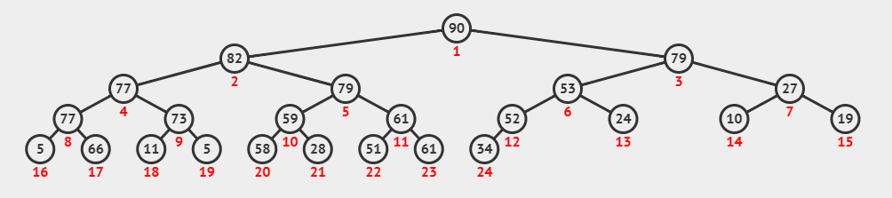

堆一般是指二叉堆，可以将一个堆看作是完全二叉树或者近似完全二叉树。

## 一、堆的相关概念

堆是一棵完全二叉树，每个节点的值都小于或等于其子节点的值，位小顶堆；反之位大顶堆。

一般用数组来表示堆，下标为 $i$ 的节点的父节点下标为 $\frac{(i-1)}{2}$ ，其左右子节点分别为 $(2i+1)$、$(2i+2)$。



在堆的数据结构中，堆的最小值总是位于根节点，堆中定义以下几种操作：

1. 最小堆调整：将堆的末端子节点做调整，使得子节点永远大于父节点；（自下而上）
2. 创建最小堆：将堆所有数据重新排序；（自上而下）
3. 堆排序：移除根节点的数据，并做最小堆调整的递归运算。

下面详细说一说堆排序的过程（以小顶堆为例来说明）。


## 二、 堆排序

堆排序（HeapSort）是指利用堆这种数据结构设计的一种排序算法，基本思想如下：

### 1. 基本思想

利用小顶堆堆顶记录是最小关键字这一特性，使得每次从无须序列中选取最小关键字变得简单。

1. 将待排序的序列构造成一个小顶堆，此时序列的最小值为根节点；
2. 依次将根节点与待排序序列的最后一个关键字交换；
3. 对交换后的序列，再从根节点到该元素的前一个节点维护一个小顶堆；
4. 重复2、3，直到得到一个递减序列。


### 2. 实现逻辑

1. 先将初始的 $ R[0...n-1]$建立成小顶堆，此时是无须序列，堆顶是最小元素；
2. 再将堆顶元素 $R[0]$ 与无序部分最后一个记录 $R[n-1]$ 交换,由此得到新的无序部分 $R[0...n-2]$ 和有序部分 $R[n-1]$，且满足 $R[0...n-2] \leq R[n-1]$
3. 由于交换后新的根 $R[0]$ 可能违反堆的性质，所以应该将当前的无序部分 $R[0...n-2]$ 调整为堆。然后再次将 $R[0]$ 与无序部分最后一个记录 $R[n-2]$ 交换，由此得到新的无序部分 $R[0...n-3]$ 和有序部分 $R[n-2...n-1]$，接下来同样将 $R[0...n-3]$ 调整为堆；
4. 直到无序部分仅有一个元素为止。

### 3. 代码实现

```c++
#include <iostream>
using namespace std;
// 两数交换
void swap(int &a, int &b)
{
    int temp = a;
    a = b;
    b = temp;
}
// 最小堆调整
void min_heapify(int *arr, int low, int high)
{
    // 父节点下标
    int parent = low;
    // 左边子节点下标       
    int child = 2*parent + 1;
    while (child <= high) {
        // 先选出两个子节点里较小的一个
        if (child + 1 <= high && arr[child] > arr[child + 1]) {
            child++;
        }
        // 比较较小的子节点和父节点哪个更小
        if (arr[parent] < arr[child]) {
            break;
        } else {
            // 父节点小于子节点的值，则交换父节点和子节点的值
            swap(arr[parent], arr[child]);
            // 将刚才交换的子节点作为父节点进行下一轮堆调整
            parent = child;
            child = 2*parent + 1;
        }
    }
}
// 堆排序
void HeapSort(int *arr, int len)
{
    // 从最后一个节点的父节点开始调整
    for (int i = (len - 1)/2;i >= 0;i--) {
        min_heapify(arr, i, len-1);
    }
    // 先把第一个元素和已经排好序的元素前一位做交换，然后重新调整，知道排序完成
    for (int i = len - 1;i >= 0;i--) {
        swap(arr[0], arr[i]);
        min_heapify(arr, 0, i - 1);
    }
}
int main()
{
    int arr[30] = {3, 5, 3, 0, 8, 6, 1, 5, 8, 6, 2, 4, 9, 4, 7, 0, 1, 8, 9, 7, 3, 1, 2, 5, 9, 7, 4, 0, 2, 6};
    HeapSort(arr, 30);
    for (int i = 0;i < 30;i++) {
        cout << arr[i] << " ";
    }
    return 0;
}
```

运行结果如下：

```shell
9 9 9 8 8 8 7 7 7 6 6 6 5 5 5 4 4 4 3 3 3 2 2 2 1 1 1 0 0 0
```


## 三、 堆排序实际用途

下面我们来说一下堆的几个非常重要的应用：

### 1. 优先级队列

队列最大的特点是先进先出，但是在优先级队列中，出队顺序不按照先进先出，而是按照优先级来，优先级高的先出队。

如何实现一个优先级队列呢？其实有很多方法，不过使用堆来实现是最直接、最高效的。因为堆和优先级队列非常相似。一个堆就可以看做是一个优先级队列。往优先级队列中插入一个元素，就相当于往堆中插入一个元素；从优先级队列中取出最高优先级的元素，就相当于取出堆顶元素。我们来看一下下面这样一个应用场景：

假如有100个小文件，每个文件的大小是100MB。每个文件中存储的都是有序的字符串。我们希望将这些小文件合并成一个有序大文件。这里就会用到优先级队列。从100个小文件中，各取出一个字符串，然后我们建立小顶堆，那堆顶的元素，也就是优先级队列的队首元素，也就是最小的字符串。将这个字符串放到大文件中，并将其从堆中删除。然后再从小文件中取出下一个字符串放入堆中。循环此过程，就可以将100个小文件的数据依次放入到大文件中。

### 2. 求top-K

我们可以把求topk的问题抽象成2类。一类是针对静态数据集合，也就是说数据集合事先确定，不会再变。另一类是针对动态数据集合，也就是说数据集合事先不确定，有数据动态地加入到集合中。

对于这两类问题，实际上实际上我们可以一直维护一个容量为K的小顶堆，当有数据要添加到集合中时，我们就拿它与堆顶元素做对比。如果比堆顶元素大，我们把堆顶元素删除，并将这个元素插入到堆中（将这个元素赋值给堆顶元素然后调整堆）；如果比堆顶元素小，我们则不做处理。这样，不论何时需要查询前K大数据，我们都可以快速返回。


最后分享一个数据结构与可视化的网站，支持很多种数据结构的演示动图，地址如下：

[Data Structure Visualization (usfca.edu)](https://www.cs.usfca.edu/~galles/visualization/Algorithms.html)，该网站支持堆、栈、队列、列表、阶乘、反转字符串、N-皇后、排序、二叉树、AVL树、红黑树、B/B+树、哈希表、图、动态规划等等可视化演示，基本都是我们很常见的数据结构与算法。