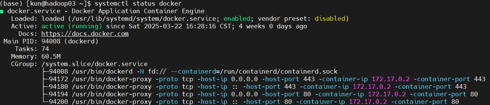
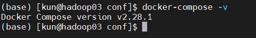

内网环境下，安装docker和docker-compose需要自行下载安装包到本地，然后配置docker服务，下面简单说说如何在内网离线安装docker。如果不关心安装过程中的细节，可以直接跳到一键安装和一键卸载。

## 一、安装

### 1. 下载离线安装包

第一步，根据自己的服务器架构类型选择docker安装包下载，可以通过以下命令查看架构类型：

```shell
uname -a
```

我的这个服务器是x86架构，结果如下：

```
Linux hadoop03 3.10.0-1160.42.2.el7.x86_64 #1 SMP Tue Sep 7 14:49:57 UTC 2021 x86_64 x86_64 x86_64 GNU/Linux
```

第二步，根据架构类型选择docker、docker-compose安装包下载

`https://download.docker.com/linux/static/stable/`

`https://github.com/docker/compose/tags`

下载docker-compose时需要访问github，因此可以从阿里云下载docker-compose可执行文件：

`https://mirrors.aliyun.com/docker-toolbox/linux/compose/`

选择合适的版本下载即可。

### 2. 安装docker

将下载后的docker安装包传到需要安装docker的服务器上，并解压安装包：

```shell
sudo tar -xvf docker-26.1.4-x86_64.tgz
```

解压后，目录下会有一个docker文件夹，包含了运行docker的可执行程序，需要给这个文件夹下的程序添加可执行权限：

```shell
sudo chmod 755 -R docker/
```

然后复制这个文件夹下的内容复制到`/usr/bin/`目录下，使docker命令可以执行：

```shell
sudo cp docker/* /usr/bin/
```

### 3. 配置docker服务

创建docker服务配置文件docker.service

```shell
sudo vim /etc/systemd/system/docker.service
```

在文件中添加以下内容：

```shell
[Unit]
Description=Docker Application Container Engine
Documentation=https://docs.docker.com
After=network-online.target firewalld.service
Wants=network-online.target

[Service]
Type=notify
ExecStart=/usr/bin/dockerd
ExecReload=/bin/kill -s HUP $MAINPID

TimeoutSec=0

RestartSec=2

ExecStartPost=/usr/sbin/iptables -P FORWARD ACCEPT
Restart=always

TimeoutStartSec=0


LimitNOFILE=infinity
LimitNPROC=infinity

LimitCORE=infinity

Delegate=yes
KillMode=process
StartLimitBurst=3
StartLimitInterval=60s

[Install]
WantedBy=multi-user.target
```

然后为docker.service添加可执行权限：

```shell
sudo chmod +x /etc/systemd/system/docker.service
```

### 4. 启动docker服务

加载systemctl配置

```shell
sudo systemctl restart daemon-reload
```

启动docker开启自启动服务（如果不需要的话可以跳过这一步）：

```shell
sudo systemctl enable docker.service
```

启动docker服务

```shell
sudo systemctl start docker
```

检查docker服务运行状态：

```shell
sudo systemctl status docker
```

若出现以下结果，说明docker正常启动：



### 5. 安装docker-compose

docker-compose可以看作是一个相对独立的服务，安装起来比较简单

第一步，将下载好的安装包传到需要安装docker-compose的服务器上，并将docker-compose复制到`/usr/local/bin`目录下，并添加可执行权限

```shell
sudo cp -f docker-compose-linux-x86_64.v2.28.1 /usr/local/bin/docker-compose && sudo chmod +x /usr/local/bin/docker-compose
```

查看docker-compose版本：

```shell
sudo docker-compose -v
```

结果如下表示安装成功



## 二、一键安装和一键卸载

创建docker和docker-compose安装脚本，实现一键安装。

### 1. 一键安装脚本

脚本内容如下：

```shell
#!/bin/bash
#定义字体颜色
RE='\033[1;31m' # Red color code
GR='\033[1;32m' # Green color code
BL='\033[1;34m' # Blue color code
PU='\033[1;35m' # Purple(紫) color code
SK='\033[1;36m' # SkyBlue(天蓝) color code
NC='\033[0m'    # Reset color to normal
 
echo '解压tar包并给与docker权限...'
tar -xvf ./package/docker* -C ./package && chmod 777 ./package/docker/*
echo '将docker移到/usr/bin目录下...'
cp -r ./package/docker/* /usr/bin/
echo '将docker.service移到/etc/systemd/system/目录并给与权限...' 
cp -r ./conf/docker.service /etc/systemd/system/ && chmod 777 /etc/systemd/system/docker.service
echo '######################'
echo '创建docker工作目录并创建daemon.json配置文件...'
mkdir -p /etc/docker && mkdir -p /data/app/dockerWork
tee /etc/docker/daemon.json <<-'EOF'
{
        "data-root":"/data/app/dockerWork",
        #"insecure-registries": ["ss.suwell.com"],
        #"registry-mirrors": ["https://geuj9lut.mirror.aliyuncs.com"]
}
EOF
echo '重新加载配置文件并重启docker...'
systemctl daemon-reload && systemctl restart docker
echo '设置docker开机自启动...'
systemctl enable docker.service
echo '######## docker版本信息 ########'
docker info
echo '将docker-compose移到/usr/bin/目录...'
cp ./conf/docker-compose* /usr/local/bin/docker-compose && chmod 777 /usr/local/bin/docker-compose
 
echo -e "${PU}######## 验证docker安装结果... ########${NC}"
if ! docker version; then
echo -e "${RE}docker 安装失败...${NC}"
exit -1
fi
echo -e "${GR}docker安装成功！！！${NC}"
 
echo -e "${PU}######## 验证docker-compose安装结果... ########${NC}"
if ! docker-compose -v; then
echo -e "${RE}docker-compose 安装失败...${NC}"
exit -1
fi
echo -e "${GR}docker-compose 安装成功！！！${NC}"
 
rm -rf ./package/docker
```

在工作目录下创建一个package文件夹，用来存放docker安装包，新建一个conf文件夹，用来存放docker.service启动文件和docker-compose安装包。将以上脚本复制到`docker-install.sh`脚本文件中，执行以下命令

```shell
mkdir package conf
mv docker.service ./conf/
mv docker-26.1.4-x86_64.tgz ./package
mv docker-compose-linux-x86_64.v2.28.1 ./conf
sh ./docker-install.sh
```

即可实现一键安装。

### 2. 一键卸载脚本

创建docker和docker-compose一键卸载脚本`docker-uninstall.sh`：

```shell
#/bin/bash
 
echo "停止所有容器服务"
docker stop $(docker ps -a -q)
echo "删除所有容器"
docker rm $(docker ps -a -q)
echo "删除docker所有镜像"
docker rmi -f $(docker images -q)
echo '停止docker服务...'
systemctl stop docker
echo '取消开机自启...'
systemctl disable docker
echo '删除docker相关包...'
cd /usr/bin/ && rm -rf containerd* ctr docker* dockerd runc
echo '取消docker.service注册文件...'
cd /etc/systemd/system/ && rm -rf docker.service
echo '删除docker配置文件...'
cd /etc/ && rm -rf docker/* && rm -rf /data/app/dockerWork
echo 'yum方式清空docker配置文件...'
yum remove -y docker-ce docker-ce-cli containerd.io
rm -rf /var/lib/docker && rm -rf /var/lib/containerd
echo '重新加载配置文件...'
systemctl daemon-reload
echo 'docker卸载成功！！！'
 
echo '删除docker-compose...'
rm -rf /usr/local/bin/docker-compose
echo 'docker-compose卸载成功！！！'
```

运行脚本

```shell
sh ./docker-uninstall.sh
```

## 三、修改docker默认镜像存储位置

docker默认会将镜像拉取到 `/var/lib/docker/` 目录下，位于linux根目录下，如果拉取的镜像服务太多，系统盘可能无法满足容量需求。为应对这一问题，可以在其他目录下挂载硬盘，用来存储镜像。接下来将演示如何把docker镜像地址修改到 `/data` 目录下，具体操作步骤如下：

### 1.迁移镜像

首先，查看docker镜像默认存储地址：

```shell
docker info
```

结果如下：

```yaml
Client:
 Version:    24.0.5
 Context:    default
 Debug Mode: false

Server:
 Containers: 11
  Running: 1
  Paused: 0
  Stopped: 10
 Images: 2
 Server Version: 24.0.5
 Storage Driver: overlay2
  Backing Filesystem: extfs
  Supports d_type: true
  Using metacopy: false
  Native Overlay Diff: true
  userxattr: false
 Logging Driver: json-file
 Cgroup Driver: cgroupfs
 Cgroup Version: 1
 Plugins:
  Volume: local
  Network: bridge host ipvlan macvlan null overlay
  Log: awslogs fluentd gcplogs gelf journald json-file local logentries splunk syslog
 Swarm: inactive
 Runtimes: io.containerd.runc.v2 runc
 Default Runtime: runc
 Init Binary: docker-init
 containerd version:
 runc version:
 init version:
 Security Options:
  apparmor
  seccomp
   Profile: builtin
 Kernel Version: 5.15.0-139-generic
 Operating System: Ubuntu 20.04.6 LTS
 OSType: linux
 Architecture: x86_64
 CPUs: 6
 Total Memory: 15.38GiB
 Name: iccnsg
 ID: 530b1091-490b-4df2-97e5-ed4bd55d4382
 Docker Root Dir: /var/lib/docker
 Debug Mode: false
 Experimental: false
 Insecure Registries:
  127.0.0.0/8
 Live Restore Enabled: false
```

然后，停止docker服务：

```shell
systemctl stop docker.service
```

在 `/data` 目录下创建 `docker_disk` 文件夹，用来迁移镜像：

```shell
mkdir -p /data/docker
cp /var/lib/docker/* /data/docker/ -r
```

### 2.修改配置文件

修改 `/etc/docker/daemon.json` 文件：

```shell
vim /etc/docker/daemon.json
```

默认情况下，系统中是没有这个文件的，需要新建这个文件并写入以下内容：

```json
{
	"data-root": "/data/docker"
}
```

保存退出后重启docker服务：

```shell
systemctl daemon-reload
systemctl restart docker
systemctl status docker
```

### 3.检查docker存储路径是否配置成功

```shell
docker info
```

结果应该如下：

```yaml
Docker Root Dir: /data/docker
```

启动成功之后，确认之前的镜像是否存在：

```shell
docker images
docker ps -a
```

确定容器启动成功之后，可以删除 `/var/lib/docker/` 目录中的文件，也可以将其备份到其他路径：

```shell
rm /var/lib/docker/* -rf
mv /var/lib/docker/* /data/docker_bak
```

## 一些废话

其实安装包方式安装docker步骤非常简单，但是安装过程中可能会出现各种各样的错误，所以最好严格按照教程操作，因为安装docker只是第一步，后面通过docker部署各种各样的应用才是我们最主要的目的。

在离线环境下，无法像外网服务器中配置环境那么方便，这个时候使用docker就是最优解。

我们可以在外网中将我们的容器打包：

```shell
docker save -o app.tar <Container ID>
```

然后拷贝到内网加载容器

```shell
docker load -i app.tar
```

如果遇到一个应用包含多个镜像时，每次加载一个镜像就略显僵硬，可以将所有tar包放在一个文件夹下，然后执行以下shell命令：

```shell
for name in `ls ./*.tar`; do docker load -i "$name"; done
```

我的做法是每次加载一个镜像（这是和公司shell大佬学的写法，也算是有所收获），工作中有些时候可以将常用命令写成脚本，这样可以节省一些工作时间，也可以避免一些错误。