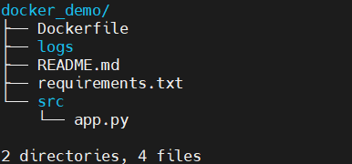

使用python进行开发时，会用到很多特定的库，一个成熟的python项目必然会依赖很多特定的环境。然而项目运行的结果不仅取决于代码，和运行代码的环境也息息相关。这很有可能会造成，开发环境上的运行结果和测试环境、线上环境上的结果都不一致的现象。为了解决这个问题，可以将python项目打包成docker镜像，这样即使在不同的机器上运行打包后的项目，我们也能够得到一致的运行结果。因为docker打包是会将项目的代码和环境一起打包。

## 准备python项目

### 1. 项目结构

项目结构如下：



各个项目、文件的作用如下：

- Dockerfile：根据这个文件内容创建docker镜像，之后会详细介绍该文件的写法；
- logs：日志记录文件，由于容器结束运行后不会保存退出前的状态，需要通过挂载宿主机的目录来同步数据；
- README.md：项目的背景介绍和使用方法；
- requirements.txt：该文件描述了python项目的依赖环境；
- src/app.py：项目源码和入口文件

### 2. 编写Dockerfile

Dockerfile文件位于项目根目录下，注意这个文件没有扩展名，且文件名不能自己修改，文件内容如下：

```dockerfile
FROM python:3.7

WORKDIR ./docker_demo

ADD . .

RUN pip install -r requirements.txt

CMD ["python", "./src/main.py"]
```

接下来将详细说明文件中每一行的操作：

FROM <基础镜像>。所谓定制镜像，那一定是以一个镜像为基础。FROM 指令用来指定以哪个镜像作为基础镜像生成新的镜像。这里我们将官方Python的3.7版本镜像作为基础镜像。

WORKDIR <工作目录路径> 。 使用 WORKDIR 指令可以来指定镜像中的工作目录（或者称为当前目录），以后各层的当前目录就被改为指定的目录。

ADD <源路径> <目标路径>。使用ADD指令可以将构建上下文目录中的<源路径>目录复制到镜像内的<目标路径>位置。对应文件中，第一个参数.代表Dockerfile所在的目录，即python项目docker_demo目录下的所有目录和文件。第二个参数.代表镜像的工作目录docker_demo。所以该行命令会将python项目docker_demo目录下的所有文件复制到镜像的docker_demo目录下。这样docker镜像中就拥有了一份docker_demo python项目。

RUN 指令是用来执行命令行命令的。这里直接安装requirements.txt 中指定的任何所需软件包。

CMD 指令是容器启动命令，这里是在容器启动时通过python运行 main.py。值得注意的是./目录指的是当前工作目录即docker_demo。

如果在之后的镜像构建过程中遇到了 `pip` 安装依赖时的版本问题，可以在安装依赖之前加上：

```dockerfile
RUN pip install --upgrade pip
```

升级镜像中的pip

## 导出环境依赖

### 1. 导出结果含有路径

将项目中使用的python依赖导出为`requirements.txt`：

```shell
pip freeze > requirements.txt
```

这条命令会将当前环境中所有已安装的包及其版本号导出到`requirements.txt`中，但是这种方式会有本地路径，迁移到别的环境中可能无法使用。这种方式生成的文件如下所示：

```shell
brotlipy==0.7.0
certifi==2020.12.5
cffi @ file:///tmp/build/80754af9/cffi_1606255122322/work
chardet @ file:///tmp/build/80754af9/chardet_1605303192865/work
conda==4.9.2
conda-pack==0.8.1
conda-package-handling @ file:///tmp/build/80754af9/conda-package-handling_1605484832764/work
cryptography @ file:///tmp/build/80754af9/cryptography_1607635322643/work
idna @ file:///tmp/build/80754af9/idna_1593446292537/work
numpy==2.0.2
pandas==2.2.3
protobuf==3.20.3
pycosat==0.6.3
pycparser @ file:///tmp/build/80754af9/pycparser_1594388511720/work
pyOpenSSL @ file:///tmp/build/80754af9/pyopenssl_1606517880428/work
PySocks @ file:///tmp/build/80754af9/pysocks_1605305812635/work
python-dateutil==2.9.0.post0
pytz==2025.2
requests @ file:///tmp/build/80754af9/requests_1606691187061/work
ruamel-yaml-conda @ file:///tmp/build/80754af9/ruamel_yaml_1605527293619/work
six @ file:///tmp/build/80754af9/six_1605205306277/work
tqdm @ file:///tmp/build/80754af9/tqdm_1607369919789/work
tzdata==2025.2
```

### 2. 导出结果不含路径

生成的`requirements.txt`不含本地路径：

```shell
pip list --format=freeze > requirements.txt
```

构建镜像时，将根据`requirments.txt`文件中的内容构建python环境。文件内容如下所示：

```shell
brotlipy==0.7.0
certifi==2020.12.5
cffi==1.14.4
chardet==3.0.4
conda==4.9.2
conda-pack==0.8.1
conda-package-handling==1.7.2
cryptography==3.3.1
idna==2.10
numpy==2.0.2
pandas==2.2.3
pip==20.3.1
protobuf==3.20.3
pycosat==0.6.3
pycparser==2.20
pyOpenSSL==20.0.0
PySocks==1.7.1
python-dateutil==2.9.0.post0
pytz==2025.2
requests==2.25.0
ruamel-yaml-conda==0.15.80
setuptools==51.0.0.post20201207
six==1.15.0
tqdm==4.54.1
tzdata==2025.2
urllib3==1.25.11
wheel==0.36.1
```

我个人一般采用第二种方式。

app.py文件内容如下：

```python
# 导入numpy验证docker是否根据requirements文件安装好了依赖
import numpy as np
import pandas as pd
import os
if __name__ == '__main__':
    # 在logs目录下创建个名为docker.log的空文件，验证容器和宿主机是否能进行数据同步
    os.mknod('../logs/docker.log')
    print("hello docker")
```


## 构建docker镜像

在docker_demo目录下运行：

```shell
sudo docker build -t demo:v1 .
```

使用 `docker build` 命令生成镜像，-t参数指定了最终的镜像名称为demo:v1。

如果注意，会看到 docker build 命令最后有一个 . 。 . 表示当前目录，这里是指将Dockerfile所在的当前目录作为构建上下文目录。

## 运行docker容器

我们用docker run运行容器 ，终端显示 hello docker 表示容器运行成功

```shell
sudo docker run demo:v1
```

如果想要进行docker的交互式终端查看项目代码，可以通过以下命令：

```shell
sudo docker exec -it $(docker ps -a -q) bash
```

但是有一点，我们的程序应该会在logs目录下创建一个docker.log文件，我们打开python项目docker_demo下的logs目录并没有发现docker.log文件。也就是说容器运行时产生的数据并没有同步到宿主机。这是由于我们并没有将宿主机的目录挂载到镜像，容器中就无法将数据同步到宿主机。

## 挂载数据卷

运行容器的时候加上-v参数 /docker_demo/logs:/logs。

```shell
sudo docker run -v /root/docker_demo/logs:/logs demo:v1 
```

通过-v能够同步容器和宿主机目录的读写，运行容器之后，我们发现docker_demo下的logs目录能多出一个docker.log文件。