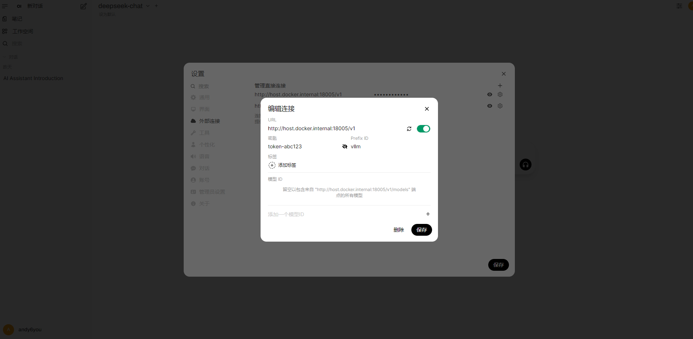

### 1. vLLM简介

vLLM（Vectorized Large Language Model Serving System）是由加州大学伯克利分校团队开发的高性能、易扩展的大语言模型（LLM）推理引擎，专注于通过创新的内存管理和计算优化技术实现高吞吐、低延迟、低成本的模型服务。vLLM采用PagedAttention内存管理技术，显著提升GPU显存利用率，同时支持分布式推理，能高效利用多机多卡资源。无论是低延迟、高吞吐的在线服务，还是资源受限的边缘部署场景，vLLM 都能提供卓越的性能表现。

### 2. modelscope简介

ModelScope‌是一个由阿里巴巴集团推出的开源模型即服务（MaaS）平台，旨在简化模型应用的过程，为AI开发者提供灵活、易用、低成本的一站式模型服务产品。该平台汇集了多种最先进的机器学习模型，涵盖自然语言处理、计算机视觉、语音识别等多个领域，并提供丰富的API接口和工具，使开发人员能够轻松地集成和使用这些模型。‌

#### 下载模型（法1）

安装modelscope：

```shell
pip install modelscope -i https://pypi.tuna.tsinghua.edu.cn/simple
```

创建模型存储目录：

```shell
mkdir -p /data/Qwen/models/Qwen-32B
```

下载模型

```shell
modelscope download --local_dir /data/Qwen/models/Qwen-32B --model Qwen/QWen-32B
```

#### 下载模型（法2）

验证git lfs是否安装：

```shell
git lfs install
```

使用git下载模型：

```shell
git clone https://www.modelscope.cn/Qwen/Qwen3-32B.git
```


### 3. 启用Nvidia GPU

更新软件包列表：

```shell
sudo apt-get update && sudo apt-get install -y nvidia-container-toolkit
```

配置nvidia容器运行时：

```shell
nvidia-ctk runtime configure --runtime=docker
```

重启服务：

```shell
systemctl daemon-reload && sudo systemctl restart docker
```

### 4. 运行vLLM容器

拉取镜像：

```shell
docker pull docker.1panel.live/vllm/vllm-openai
```

启动vLLM容器：

```shell
docker run \
-itd --restart=always \
--name Qwen-32B \
-v /data/Qwen:/data \
-p 18005:8000 --gpus \
device=0 \
--ipc=host --shm-size=16g vllm/vllm-openai:latest \
--dtype bfloat16 --served-model-name Qwen-32B \
--model "/data/models/Qwen-32B" \
--tensor-parallel-size 1 \
--gpu-memory-utilization 0.95 \
--max-model-len 81920 \
--api-key token-abc123 \
--enforce-eager
```

docker命令参数详解：

- **-i（interactive）**：允许用户与容器进行交互，即使容器不在前台运行。用户可以通过`docker logs`或`docker attach`命令查看容器的输出日志
- **-t（tty）**：分配一个伪TTY（虚拟终端）到容器，模拟终端环境。
- **-d（detach）**：在后台运行容器，不占用当前终端。
- **--restart=always**：设置容器在主机重启或容器退出后自动重启。
- **--name Qwen-32B**：为容器指定一个唯一的名称。
- **-v /data/Qwen:/data**：将宿主机上的`/data/Qwen`目录挂载到容器内的`/data`目录。避免容器重启或删除而导致的数据丢失问题。
- **-p 18005:8000**：将宿主机的18005端口映射到容器内的8000端口。
- **--gpus '"device=1,2,3,4"'**：指定容器使用宿主机上的GPU设备1、2、3、4。
- **--ipc=host**：共享宿主机的IPC（进程间通信）命名空间，允许容器与宿主机的进程进行通信。

vLLM模型启动参数：

- **--dtype bfloat16**：指定使用bfloat16（Brain Floating Point 16）进行模型计算。
- **--served-model-name Qwen-32B**：设置模型的服务名称为“Qwen-32B”，用于API请求时的模型标识。
- **--model "/data/models/Qwen-32B"**：指定模型文件的路径为容器内的`/data/models/Qwen-32B`。
- **--tensor-parallel-size 4**：设置张量并行的规模为4，对应使用4块GPU进行模型并行计算。
- **--gpu-memory-utilization 0.85**：设置GPU内存使用率为85%，预留15%的内存空间，防止因内存溢出导致的程序崩溃。
- **--max-model-len 81920**：指定模型的最大上下文长度为81920 Token。模型在单次推理中可以处理的输入和输出的总Token数不超过81920个。
- **--api-key token-abc123**：设置API访问密钥为“token-abc123”，调用API时需要在请求头中提供此密钥。
- **--enforce-eager**：启用Eager执行模式，确保模型推理时逐层计算，避免由于延迟执行可能引发的内存问题。

#### 5. Open Web UI部署

拉取open-webui镜像

```shell
docker pull ghcr.nju.edu.cn/open-webui/open-webui:main
```

启动Open Web UI

```shell
docker run 
-d -p 3000:8080 \
--add-host=host.docker.internal:host-gateway \
-v /data/open-webui:/app/backend/data \
--name open-webui 
--restart always ghcr.nju.edu.cn/open-webui/open-webui:main
```

访问web界面：

`http://localhost:3000`

然后点击头像-设置-外部连接-添加一个连接。



需要注意的是，这里使用 `http://host.docker.internal:18005`来访问模型，并且需要在url后拼接上`v`，即：

`http://host.docker.internal:18005/v1`

然后就可以开启新对话，使用vLLM部署好的模型了。