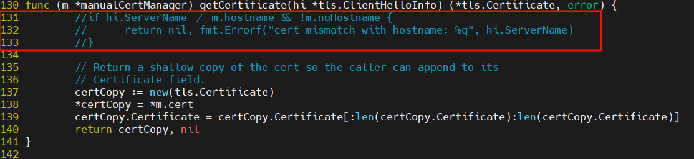
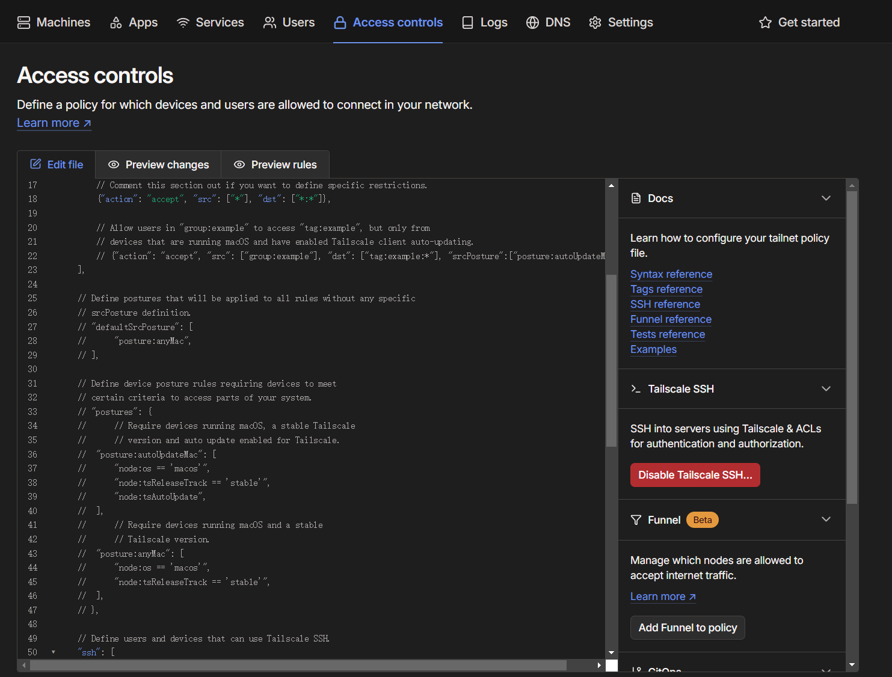

## 自建tailscale的DERP中继教程

通过Tailscale可以使用内网穿透管理和访问不同局域网中的设备，但是官方提供的公用服务器一般情况下不在大陆，所以延迟很高；并且由于公有的原因，网络条件经常不稳定。为了降低延迟、提高带宽，所以要自建DERP。

### 1. DERP中继服务器介绍

tailscale所有客户端之间的连接都是DERP模式（中继模式），这意味着连接立即就能建立，用户不需要任何等待。然后会开始并行的路径发现，通常在几秒钟之后，tailscale就能发现一条更优路径，然后将现有连接透明升级（upgrade）过去，变成点对点（peer to peer）连接。因此，DERP可以作为tailscale在NAT穿透失败时的保底通信方式。

实际上，tailscale官方建立了很多DERP服务器，分布在全球各地（除了中国大陆）。这就导致一点流量通过公共DERP服务器进行中继，延时会非常高。

我们可以通过在国内公网服务器上自建DERP中继的方式来解决这一问题。公网云服务器可以选择一些ECS或者轻量应用服务器，各大云服务器厂商都有提供。这里我使用的是京东云服务器。

### 2. 搭建步骤

准备好一台公网云服务器后，就可以开始以下操作。

#### 1. 安装go环境

首先安装所需软件（如果已安装，可以跳过这一步）

```shell
apt install -y wget git openssl curl
```

然后安装go

```shell
wget https://go.dev/dl/go1.23.5.linux-amd64.tar.gz && \
rm -rf /usr/local/go && \
tar -C /usr/local -xzf go1.23.5.linux-amd64.tar.gz 
```

添加环境变量（临时添加）

```shell
export PATH=$PATH:/usr/local/go/bin
```

如果想永久添加到环境变量

```shell
echo "export PATH=$PATH:/usr/local/go/bin" >> /etc/profile && source /etc/profile
```

之后验证一下是否安装成功

```shell
go version
```


#### 2. 通过go安装DERP

运行go下载DERP

```shell
go install tailscale.com/cmd/derper@latest
```

这里会访问tailscale官去下载软件包，如果卡住的话，可以切换一下go的镜像源。

#### 3. 处理证书文件

安装完成后，需要处理证书文件，证书文件路径如下：


注释cert.go代码中的如下部分：



不同derper版本的代码内容可能不同，可以通过搜索 `getCertification` 函数快速定位。

#### 4. 重新编译derper

然后在当前目录下用 go 重新编译一下，并输出的指定目录 `/etc/derp/derper`

```shell
go build -o /etc/derp/derper
```

检查是否编译成功

```shell
ls /etc/derp/derper
```

输出以下代码表示编译成功

```shell
/etc/derp/derper
```

#### 5. 自签域名给DERP

接下来用命令自签一个 `https` 域名 `derp.myself.com`

```shell
openssl req -x509 -newkey rsa:4096 -sha256 -days 3650 -nodes -keyout /etc/derp/derp.myself.com.key -out /etc/derp/derp.myself.com.crt -subj "/CN=derp.myself.com" -addext "subjectAltName=DNS:derp.myself.com"
```

接下来在服务器上使用以下命令：

```shell
cat > /etc/systemd/system/derp.service <<EOF
[Unit]
Description=TS Derper
After=network.target
Wants=network.target
[Service]
User=root
Restart=always
ExecStart=/etc/derp/derper -hostname derp.myself.com -a :33445 -http-port 33446 -certmode manual -certdir /etc/derp --verify-clients
RestartPreventExitStatus=1
[Install]
WantedBy=multi-user.target
EOF
```

注意这里需要打开云服务器上的 `tcp 33445` 和 `udp 3478` （STUN需要）端口安全组。

然后输入以下命令，打开自启，并立即启动derp服务：

```shell
systemctl enable derp
systemctl start derp
```

#### 6. 验证DERP是否启动

在浏览器中输入 `https://<your-ip>:33445/` 即可验证DERP是否启动


如果页面显示以上内容，说明服务启动成功了。

#### 7. 在tailscale控制台添加DERP中转

接下来进入tailscale控制台设置DERP中转



在配置文件中添加以下内容：

```json
  "derpMap": {
    "OmitDefaultRegions": true,
    "Regions": {
      "901": {
        "RegionID":   901,
        "RegionCode": "Myself",
        "RegionName": "Myself Derper",
        "Nodes": [
          {
            "Name":             "901a",
            "RegionID":         901,
            "DERPPort":         33445,
            "IPv4":             "youripv4",
            "InsecureForTests": true,
          },
        ],
      },
    },
  },
```

#### 8. 检查tailscale中转是否添加成功

最后在服务器上查看tailscale中转是否添加成功

```shell
tailscale netcheck
```

若显示以下内容，说明添加成功

