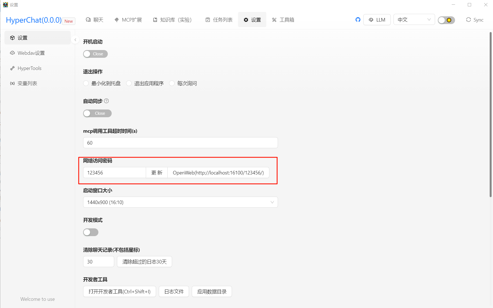
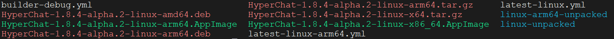

## MCP客户端HyperChat打包及镜像构建

HyperChat是一个开源的Chat客户端，支持MCP，可以使用各家LLM的API，实现最好的Chat体验。以及实现生产力工具。支持OpenAI风格的LLM，包括 OpenAI, Claude, Qwen, DeepSeek, Gemini等模型。

### 1.拉取源码本地构建

从作者github仓库拉取源码：

```shell
git clone https://github.com/BigSweetPotatoStudio/HyperChat -b v1.8.4
```

这里我指定的分支为最新的`v1.8.4`版本。

源码目录结构如下：

```
HyperChat/
├── ChangeLog.md
├── ChangeLog.zh.md
├── CLAUDE.md
├── common
├── dependencies
├── docker
├── Dockerfile
├── docs
├── electron
├── hyperchat-vscode-extension
├── images
├── LICENSE
├── node_modules
├── package.json
├── package-lock.json
├── README.md
├── README.zh.md
├── task.mts
├── translate.mts
├── tsconfig.json
└── web
```

（构建过程中会用到node，本人使用的node为`v20.19.3`、npm版本为 `10.8.2`）

分别进入 `electron` 目录和 `	web` 目录安装依赖：

```shell
cd electron && npm install
cd ../
cd web && npm install
```

然后返回 `HyperChat` 工作目录下安装依赖：

```shell
npm install
```

进入开发模式：

```shell
npm run dev
```

等待片刻后桌面就会出现 Electron 客户端，可以通过electron客户端设置中的web url打开web页面。




### 2. 打包可执行文件

首先，需要打包web源码：

```shell
cd web && npm run build
```

然后进入electron目录打包：

```shell
cd electron && npm run build
```

node会根据当前平台操作系统和架构打包出可执行文件和安装包，比较奇怪的是在Linux环境下打包，会打出所有架构的安装包（包括x86_64、arm64以及macos）

打包完成后，可以在 `electron/dist`目录下查看安装包可执行文件：



以 `debian` 安装包为例安装HyperChat

```shell
dpkg -i HyperChat-1.8.4-alpha.2-linux-amd64.deb 
```

会将HyperChat默认安装到 `/opt` 目录下，运行hyper-chat可执行文件后即可启动客户端：

```shell
/opt/HyperChat/hyper-chat
```


### 3. 构建镜像

这里只介绍web端（不使用electron）镜像的构建方法，如果对另一种方式感兴趣可以自行探索。

构建镜像之前，需要在 `electron` 目录下打包 node：

```shell
cd electron
npm run build:node
```

然后会在 `electron/js` 目录下生成 `main_no_electron.js` 等js文件，启动前端界面时会用到。

作者给出的 Dockerfile 位于 `docker/no_electron` 目录下，内容如下：

```dockerfile
FROM ubuntu:22.04

# Update package lists
RUN apt-get update

# Install curl and other dependencies
RUN apt-get install -y curl

# Add NodeSource repository for Node.js LTS
RUN curl -fsSL https://deb.nodesource.com/setup_20.x | bash -
# Install Node.js and npm
RUN apt-get install -y nodejs

# Install Python and pip
RUN apt-get install -y python3 python3-pip
# With pip.
RUN pip install uv

COPY ../../electron/ /root/hyperchat

ENV NODE_ENV=production

CMD ["node", "/root/hyperchat/js/main_no_electron.js"]
```

仔细观察这个Dockerfile可以发现，在 `COPY` 命令时有问题。因为docker构建镜像过程中，是不允许从Dockerfile所在目录之外复制文件的，所以可以在 `HyperChat`目录下新建一个Dockerfile，然后修改为以下内容：

```dockerfile
FROM ubuntu:22.04

# Update package lists
RUN apt-get update

# Install curl and other dependencies
RUN apt-get install -y curl

# Add NodeSource repository for Node.js LTS
RUN curl -fsSL https://deb.nodesource.com/setup_20.x | bash -
# Install Node.js and npm
RUN apt-get install -y nodejs

# Install Python and pip
RUN apt-get install -y python3 python3-pip
# With pip.
RUN pip install uv

COPY ./electron/ /root/hyperchat

ENV NODE_ENV=production

CMD ["node", "/root/hyperchat/js/main_no_electron.js"]
```

然后执行以下命令构建镜像：

```shell
docker build -t hyperchat-web:latest .
```

打包完成后，可以使用作者给出的 `docker-compose.yml` 启动容器：

```yaml
version: '3'

services:
  hyperchat:
    image: hyperchat-web:latest
    ports:
      - "16100:16100"
    volumes:
      - "./HyperChat:/root/Documents/HyperChat"
    restart: unless-stopped
```

由于启动容器较为简单，可以使用docker直接启动：

```shell
docker run -it -d \
--name hyperchat \
-p 16100:16100 \
-v ./HyperChat:/root/Documents/HyperChat \
hyperchat-web:latest
```

启动容器后，即可通过 `http://<ip>:16100/123456` 访问HyperChat页面了。

### 4. 替换项目打包内容

这样每次在修改前端重新打包为生产模式后，需要重新构建docker镜像，为简化开发过程，将宿主机文件挂载到容器中的启动文件夹`/root/hyperchat`，具体步骤如下：

首先启动容器：

```shell
docker run -itd --name hyperchat hyperchat-web:latest
```

然后在本地创建文件夹，将容器内的项目打包内容复制到宿主机：

```shell
mkdir /data/web/hyperchat
docker cp hyperchat:/root/hyperchat/* /data/web/hyperchat/*
```

然后停止并删除容器后正式启动容器：

```shell
docker stop hyperchat && docker rm hyperchat
docker run -itd --name hyperchat \
-p 16100:16100 \
-v /data/web/hyperchat:/root/hyperchat \
-v /data/web/Documents:/root/Documents \
hyperchat-web:latest
```

后续可以将打包完成后的文件复制到宿主机`/data/web/hyperchat/`目录下，完成前端的替换。