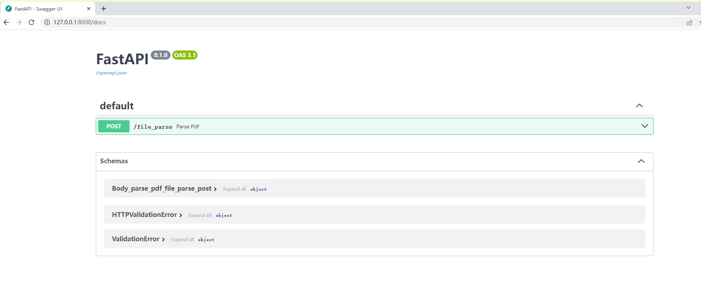

## MinerU服务部署

MinerU是一款由OpenDataLab研发，将PDF或图片转换为机器可读格式（如Markdown、json）的工具，可以在很多项目中作为OCR服务进行集成，大大提高开发过程中提取pdf扫描件、图片中信息的效率。

感兴趣的朋友可以先在线体验下MinerU提供的官方接口[MinerU-免费全能的文档解析神器](https://mineru.net/OpenSourceTools/Extractor)。同时，MinerU提供了便捷的部署方式，有助于快速搭建环境并解决一些令人头疼的环境兼容问题，可以很高效地在内网和离线环境中部署服务。

这是官方提供的一个技术说明和配置要求表格，可以先做些简单了解：

| 特性         | pipeline                                    | vlm-transformers             | vlm-sglang                 |
| ------------ | ------------------------------------------- | ---------------------------- | -------------------------- |
| 操作系统     | Linux / Windows / macOS                     | Linux / Windows              | Linux / Windows (via WSL2) |
| CPU推理支持  | 支持                                        | 不支持                              | 同前 |
| GPU要求      | Turing及以后架构，6G显存以上或Apple Silicon | Turing及以后架构，8G显存以上 | 同前 |
| 内存要求     | 最低16G以上，推荐32G以上                    | 同前 | 同前 |
| 磁盘空间要求 | 20G以上，推荐使用SSD                        |                              | 同前 |
| Python版本   | 3.10-3.13                                   |                              | 同前 |

### 

### 1.使用Dockerfile构建镜像

首先下载Dockerfile文件：

```shell
wget https://gcore.jsdelivr.net/gh/opendatalab/MinerU@master/docker/china/Dockerfile
```

我在构建镜像过程中遇到了一些问题，所以对原来了Dockerfile文件做了几处修改，内容如下：

```dockerfile
# Use DaoCloud mirrored sglang image for China region
# FROM local/sglang:cu126
# For blackwell GPU, use the following line instead:
# 修改1：使用docker desktop拉取这个基础镜像，我直接拉取了docker.io上的基础镜像
# FROM docker.m.daocloud.io/lmsysorg/sglang:v0.4.9.post6-cu128-b200

# Use the official sglang image
FROM lmsysorg/sglang:v0.4.9.post6-cu126
# For blackwell GPU, use the following line instead:
# FROM lmsysorg/sglang:v0.4.9.post6-cu128-b200

# Install libgl for opencv support & Noto fonts for Chinese characters
# 修改2：由于fonts-noto-core等几个字体包太大，从ubuntu官方镜像站下载可能会导致中断，所以直接替换为阿里源
RUN sed -i 's|http://.*.ubuntu.com|http://mirrors.aliyun.com|g' /etc/apt/sources.list && \
    apt-get update && \
    apt-get install -y \
        fonts-noto-core \
        fonts-noto-cjk \
        fontconfig \
        libgl1 && \
    fc-cache -fv && \
    apt-get clean && \
    rm -rf /var/lib/apt/lists/*

# Install mineru latest
RUN python3 -m pip install -U 'mineru[core]' -i https://mirrors.aliyun.com/pypi/simple --break-system-packages && \
    python3 -m pip cache purge

# Download models and update the configuration file
RUN /bin/bash -c "mineru-models-download -s modelscope -m all"

# Set the entry point to activate the virtual environment and run the command line tool
ENTRYPOINT ["/bin/bash", "-c", "export MINERU_MODEL_SOURCE=local && exec \"$@\"", "--"]
```

使用我修改后的Dockerfile文件应该可以正常构建镜像，命令如下：

```shell
docker build -t mineru-sglang:latest -f Dockerfile .
```

由于镜像过大，趁这个时候可以浅浅摸一会儿🐟。

这里有一点问题，不知道大家是否注意到了。直接从docker.io拉取基础镜像，这并不是个好的解决办法，因为这里涉及到了一些科学上网方面的知识，因此我们可以从国内拉取基础镜像，在基础镜像基础上构建`sglang:v0.4.9.post6-cu126`这个镜像。这个操作我会在最后说明。

### 2.启动 Docker 容器

```shell
docker run --gpus all \
  --shm-size 32g \
  -p 30000:30000 -p 7860:7860 -p 8000:8000 \
  --ipc=host \
  -it mineru-sglang:latest \
  /bin/bash
```

执行该命令后，您将进入到Docker容器的交互式终端，并映射了一些端口用于可能会使用的服务，您可以直接在容器内运行MinerU相关命令来使用MinerU的功能，也可以直接通过替换`/bin/bash`为服务启动命令来启动MinerU服务，

### 3.通过 Docker Compose 直接启动服务

OpenDataLab提供了 docker-compose.yaml 文件，可以通过该文件快速启动MinerU服务：

```shell
wget -O docker-compose.yaml https://gcore.jsdelivr.net/gh/opendatalab/MinerU@master/docker/compose.yaml
```

该文件中包含了MinerU的多个服务配置，可以根据需要启动指定的服务：

```yaml
services:
  mineru-sglang-server:
    image: mineru-sglang:latest
    container_name: mineru-sglang-server
    restart: always
    profiles: ["sglang-server"]
    ports:
      - 30000:30000
    environment:
      MINERU_MODEL_SOURCE: local
    entrypoint: mineru-sglang-server
    command:
      --host 0.0.0.0
      --port 30000
      # --enable-torch-compile  # You can also enable torch.compile to accelerate inference speed by approximately 15%
      # --dp-size 2  # If using multiple GPUs, increase throughput using sglang's multi-GPU parallel mode
      # --tp-size 2  # If you have more than one GPU, you can expand available VRAM using tensor parallelism (TP) mode.
      # --mem-fraction-static 0.5  # If running on a single GPU and encountering VRAM shortage, reduce the KV cache size by this parameter, if VRAM issues persist, try lowering it further to `0.4` or below.
    ulimits:
      memlock: -1
      stack: 67108864
    ipc: host
    healthcheck:
      test: ["CMD-SHELL", "curl -f http://localhost:30000/health || exit 1"]
    deploy:
      resources:
        reservations:
          devices:
            - driver: nvidia
              device_ids: ["0"]
              capabilities: [gpu]

  mineru-api:
    image: mineru-sglang:latest
    container_name: mineru-api
    restart: always
    profiles: ["api"]
    ports:
      - 8000:8000
    environment:
      MINERU_MODEL_SOURCE: local
    entrypoint: mineru-api
    command:
      --host 0.0.0.0
      --port 8000
      # parameters for sglang-engine
      # --enable-torch-compile  # You can also enable torch.compile to accelerate inference speed by approximately 15%
      # --dp-size 2  # If using multiple GPUs, increase throughput using sglang's multi-GPU parallel mode
      # --tp-size 2  # If you have more than one GPU, you can expand available VRAM using tensor parallelism (TP) mode.
      # --mem-fraction-static 0.5  # If running on a single GPU and encountering VRAM shortage, reduce the KV cache size by this parameter, if VRAM issues persist, try lowering it further to `0.4` or below.
    ulimits:
      memlock: -1
      stack: 67108864
    ipc: host
    deploy:
      resources:
        reservations:
          devices:
            - driver: nvidia
              device_ids: [ "0" ]
              capabilities: [ gpu ]

  mineru-gradio:
    image: mineru-sglang:latest
    container_name: mineru-gradio
    restart: always
    profiles: ["gradio"]
    ports:
      - 7860:7860
    environment:
      MINERU_MODEL_SOURCE: local
    entrypoint: mineru-gradio
    command:
      --server-name 0.0.0.0
      --server-port 7860
      --enable-sglang-engine true  # Enable the sglang engine for Gradio
      # --enable-api false  # If you want to disable the API, set this to false
      # --max-convert-pages 20  # If you want to limit the number of pages for conversion, set this to a specific number
      # parameters for sglang-engine
      # --enable-torch-compile  # You can also enable torch.compile to accelerate inference speed by approximately 15%
      # --dp-size 2  # If using multiple GPUs, increase throughput using sglang's multi-GPU parallel mode
      # --tp-size 2  # If you have more than one GPU, you can expand available VRAM using tensor parallelism (TP) mode.
      # --mem-fraction-static 0.5  # If running on a single GPU and encountering VRAM shortage, reduce the KV cache size by this parameter, if VRAM issues persist, try lowering it further to `0.4` or below.
    ulimits:
      memlock: -1
      stack: 67108864
    ipc: host
    deploy:
      resources:
        reservations:
          devices:
            - driver: nvidia
              device_ids: [ "0" ]
              capabilities: [ gpu ]
```

通过观察这个文件，不难发现MinerU主要提供三个服务：

#### 1. sglang-server 服务

通过`vlm-sglang-client`后端连接`sglang-server`：

```shell
docker compose --profile sglang-server up -d
```


#### 2. Web API 服务

```shell
docker compos --profile api up -d
```

在浏览器中访问 `http://<server_ip>:8000/docs` 查看API文档。



#### 3. Gradio WebUI 服务

这个服务主要功能是提供了一个可视化界面，用来帮助用户体验MinerU提取PDF、图片信息的效果。

```shell
docker compose --profile gradio up -d
```

在浏览器中访问 `http://<server_ip>:7860` 使用 Gradio WebUI。

访问 `http://<server_ip>:7860/?view=api` 使用 Gradio API。

到这里整个MinerU服务就部署完成可以正常使用了，后续想要将 MinerU 投入生产环境中还需要做3个工作：

1. 压力测试，测试最大并发量；
2. 对上传临时文件进行管理，这涉及到二次开发工作。

完成部署只是第一步，后续想要将MinerU集成进现有的系统，还需要对接口进行二次开发，至少需要搞明白sglang的工作原理，然后找到mineru-api这个容器服务的代码，这样才能由二次开发的基础。

### 随便讲讲

想要保证MinerU服务正常启动，首先需要确保Cuda不低于12.6，但是问题来了，我并没有从国内的镜像站上找到满足版本要求的sglang镜像。docker.io镜像站倒是有，但是这个拉取速度就一言难尽了，所以我尝试自行构建sglang镜像。

首先，从Dockerfile中不难判断出，使用`apt` 进行包管理，不难判断出这是一个基于Ubuntu或Debian的操作系统，从docker.io镜像站中查找到了对应 tag 为 `v0.4.9.post6-cu126` 镜像的操作系统版本为 Ubuntu 22.04，因此可以直接将其作为基础镜像，Dockerfile如下：

```dockerfile
# 基础镜像：CUDA 12.6 + Ubuntu 22.04
FROM swr.cn-north-4.myhuaweicloud.com/ddn-k8s/docker.io/nvidia/cuda:12.6.3-cudnn-devel-ubuntu22.04

# 设置环境变量
ENV DEBIAN_FRONTEND=noninteractive \
    TZ=Asia/Shanghai \
    PIP_INDEX_URL=https://pypi.tuna.tsinghua.edu.cn/simple

# 换源 & 安装基础依赖
RUN sed -i 's/archive.ubuntu.com/mirrors.tuna.tsinghua.edu.cn/g' /etc/apt/sources.list && \
    sed -i 's/security.ubuntu.com/mirrors.tuna.tsinghua.edu.cn/g' /etc/apt/sources.list && \
    apt-get update && apt-get install -y \
    git \
    curl \
    wget \
    build-essential \
    python3 \
    python3-pip \
    python3-venv \
    ninja-build \
    cmake \
    libnuma1 \
    libglib2.0-0 && \
    && rm -rf /var/lib/apt/lists/*

# 升级 pip
RUN python3 -m pip install --upgrade pip setuptools wheel

# 克隆 sglang 源码
WORKDIR /workspace
# RUN git clone https://gitee.com/mirrors/sglang
COPY sglang-v0.4.9.post6 /workspace/sglang
WORKDIR /workspace/sglang

# 切换到稳定版本（v0.4.9.post6）
# RUN git checkout v0.4.9.post6

# 安装依赖并构建
RUN pip install -e "python[all]"

# 默认启动交互式 shell
CMD ["/bin/bash"]
```

这里我是直接将对应版本的sglang源码下载到了本地，因为容器内部没有设置gitee的DNS，这里也可以在执行`docker build`命令时指定DNS服务器，也可以通过我的方式，不过需要对应修改Dockerfile内容。

开始构建：

```shell
docker build -t sglang:v0.4.9.post6-cu126 .
```

构建好之后，就做好了 MinerU 的基础镜像，就可以开始构建了。

遇到任何问题，先用 `docker logs -f` 配合一些点点点操作来看看日志，通过日志可以解决很多问题。

不夸张地说，日志分析能力是实施、运维工作中的一大利器。

