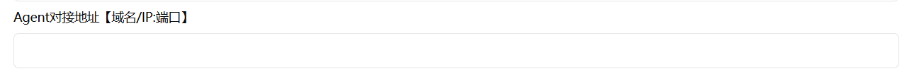

## 部署nezha（哪吒）监控面板

nezha（哪吒）是一款开源的轻量化服务器监控和运维工具，提供实时性能监控与告警通知。对于企业用户来说，nezha可以帮助实时监控服务器健康状况、网络响应、SSL证书状态，同时支持各种丰富的告警和自动化功能，彻底双手！告辞烦人的命令行操作、避免低效的监控方式，大幅提升运维效率。对于个人开发者来说，可以很方便的管理自己的机器和设备，提高生产力水平。

这个工具安装要分为两部分介绍，一是Dashboard，这部分安装在服务器上，负责提供前台和后台管理；二是Agent，这部分安装在需要接入Dashboard的机器上，接入之后可以通过Dashboard进行统一管理。

在开始之前，请确保主机上安装了docker。

### 1. 在服务器上安装Dashboard

#### 1.1 启动服务 

创建 `docker-compose.yml` 文件如下：

```yaml
services:
  dashboard:
    image: ghcr.io/nezhahq/nezha
    restart: always
    ports:
      - "127.0.0.1:8008:8008"
    volumes:
      - /data/nezha/data:/dashboard/data
```

注意，这里在映射端口号时监听本地，这是为了防止端口被扫描，我也是第一次见这种本地监听+反向代理的写法。

由于网络问题，可能无法直接从 `ghcr.io` 拉取镜像，可以替换为南京大学镜像源：

```yaml
services:
  dashboard:
    image: ghcr.nju.edu.cn/nezhahq/nezha
    restart: always
    ports:
      - "127.0.0.1:8008:8008"
    volumes:
      - /data/nezha/data:/dashboard/data
```

然后使用 `docker-compose up -d` 可以直接启动。

#### 1.2 配置反向代理

接下来是反向代理操作，这里我看网上一些大佬用了caddy （[Docker部署哪吒监控](https://emohe.cn/posts/10/)）做反向代理，感觉比nginx要简单很多，所以这里简单介绍一下。

1. 安装必要依赖

   ```bash
   sudo apt install -y debian-keyring debian-archive-keyring apt-transport-https
   ```

2. 导入 Caddy 官方 GPG 密钥：

   ```bash
   curl -1sLf 'https://dl.cloudsmith.io/public/caddy/stable/gpg.key' | sudo gpg --dearmor -o /usr/share/keyrings/caddy-stable-archive-keyring.gpg
   ```

3. 添加 Caddy 软件源：

   ```bash
   curl -1sLf 'https://dl.cloudsmith.io/public/caddy/stable/debian.deb.txt' | sudo tee /etc/apt/sources.list.d/caddy-stable.list
   ```

4. 更新包列表并安装 Caddy：

   ```bash
   sudo apt update
   sudo apt install caddy
   ```

   当然，这里可能会由于网络问题在第4步卡住，也可以直接根据系统去github上下安装包：[Releases · caddyserver/caddy](https://github.com/caddyserver/caddy/releases)

   我的这台服务器是 Ubuntu 22.04，所以下这个包：

   ```bash
   # 1.下载
   wget https://github.com/caddyserver/caddy/releases/download/v2.10.2/caddy_2.10.2_linux_amd64.deb
   # 2.安装
   dpkg -i caddy_2.10.2_linux_amd64.deb
   ```

5. 验证，安装完成后，可以通过以下命令验证 Caddy 是否成功安装：

   ```bash
   caddy version
   ```

   如果安装成功，会显示当前 Caddy 的版本信息

6. 启动caddy服务：

   ```bash
   systemctl start caddy
   ```

7. 配置反向代理

   caddy的配置文件为 `/etc/caddy/Caddyfile`，如下配置：

   ```shell
   example.com {
       reverse_proxy /proto.NezhaService/* h2c://127.0.0.1:8008
       
       reverse_proxy /* 127.0.0.1:8008
   }
   ```

   这个 `example.com` 是你的域名，如果没有域名，也可用下面这种方式做反向代理：

   ```shell
   :18008 {
       reverse_proxy /proto.NezhaService/* h2c://127.0.0.1:8008
       
       reverse_proxy /* 127.0.0.1:8008
   }
   ```

   可以通过访问`http://<your-ip>:18008` 来访问Dashboard。

实际上，ip地址也可用自签的证书，这一点内容我之后再补充。

#### 1.3 安装结果

进入dashboard界面后，输入默认用户名和密码即可进入，这里强烈建议进去以后先把密码修改成强密码，不然可能会被暴力破解。


这里我已经加入了两台服务器，接下来讲如何在机器上安装nezha-agent，通过dashboard管理。

### 2. 在要管理的机器上安装Agent

安装Agent的方法有很多，比较方便的是官网上提供的这种方法，可以看到安装命令这个地方，可以根据机器类型复制安装命令，目前提供Windows、macOS、Linux三种操作系统的Agent安装脚本。

#### 2.1 配置Agent对接地址

在复制安装命令之前，需要在dashboard系统配置中配置Agent对接地址：



这个地址实际上就是访问dashboard的地址，比如说我的地址就是`http://<ip>:18008`。

#### 2.2 复制安装脚本安装

这里以Linux安装命令为例：

```bash
curl -L https://raw.githubusercontent.com/nezhahq/scripts/main/agent/install.sh -o agent.sh && chmod +x agent.sh && env NZ_SERVER=<ip>:18008 NZ_TLS=false NZ_CLIENT_SECRET=<secret> ./agent.sh
```

同样地，由于网络问题，这个install.sh脚本可能无法正常拉取，可以先复制脚本内容（不多，200行左右），然后在服务器上新建脚本文件。

但是我在安装过程中，还是遇到了网络问题，我查看了脚本内容，发现`isCN`这个参数默认为 `false`，需要将其设置为 `true` 才会从gitee下载可执行文件，因此需要对安装命令做些修改：

```bash
curl -L https://raw.githubusercontent.com/nezhahq/scripts/main/agent/install.sh -o agent.sh && chmod +x agent.sh && env NZ_SERVER=<ip>:18008 NZ_TLS=false isCN=true NZ_CLIENT_SECRET=<secret> ./agent.sh
```

安装成功会有提示，并且可以在面板中看到新加入的机器。

### 简单讲讲

关于这个工具的使用，后续还需要继续摸索摸索，因为我在管理面板中看到了应用防火墙、内网穿透这些有意思的东西，感兴趣的朋友们也可以深入研究一下。

这个工具在定位上来说，属于zabbix的平替，但是毕竟是个轻量化的运维服务，比起zabbix庞大的架构和复杂的功能来说，还是有点不够看，后面也会补一期zabbix安装和部署教程。 

