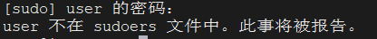

## 对Linux中sudo的一些理解

首先介绍一下Linux中的两类用户，一种是超级用户（root），另外一种是普通用户。在管理一台服务器时，我们通常不会使用root去执行操作，因为root用户具有很大的权限，可能会执行一些危险的命令，导致服务器崩溃。然而，在运维过程中我们可能需要执行一些系统管理任务，我们通常会使用sudo来执行这些命令。

sudo是Linux中的一个常见命令，允许普通用户以root身份执行命令，下面我来讲一讲关于sudo的一些操作。

我们从新建一个用户开始，来讲解关于sudo的操作。

首先，新建一个用户然后切换到该用户的bash

```bash
adduser user
su user
```

然后在user用户的bash中执行 `sudo apt update` 命令，会出现这个信息:



把这个用户加入root组也依然会报这个错误。

让我们来观察这个提示，按照这个提示，我们需要去修改sudoers文件，这个文件路径是 `/etc/sudoers`

```bash
-r--r----- 1 root root 1.7K  8月  3  2022 /etc/sudoers
```

可以看到这个文件是个只读文件，并且普通用户甚至都没有读权限，想要修改这个文件，需要先将这个文件权限修改为可写：

```bash
chmod 660 /etc/sudoers
```

修改后这个文件权限会变成这样：

```bash
-rw-rw---- 1 root root 1.7K  8月  3  2022 /etc/sudoers
```

然后来查看这个文件的内容：

```bash
#
# This file MUST be edited with the 'visudo' command as root.
#
# Please consider adding local content in /etc/sudoers.d/ instead of
# directly modifying this file.
#
# See the man page for details on how to write a sudoers file.
#
Defaults        env_reset
Defaults        mail_badpass
Defaults        secure_path="/usr/local/sbin:/usr/local/bin:/usr/sbin:/usr/bin:/sbin:/bin:/snap/bin"
Defaults        use_pty

# This preserves proxy settings from user environments of root
# equivalent users (group sudo)
#Defaults:%sudo env_keep += "http_proxy https_proxy ftp_proxy all_proxy no_proxy"

# This allows running arbitrary commands, but so does ALL, and it means
# different sudoers have their choice of editor respected.
#Defaults:%sudo env_keep += "EDITOR"

# Completely harmless preservation of a user preference.
#Defaults:%sudo env_keep += "GREP_COLOR"

# While you shouldn't normally run git as root, you need to with etckeeper
#Defaults:%sudo env_keep += "GIT_AUTHOR_* GIT_COMMITTER_*"

# Per-user preferences; root won't have sensible values for them.
#Defaults:%sudo env_keep += "EMAIL DEBEMAIL DEBFULLNAME"

# "sudo scp" or "sudo rsync" should be able to use your SSH agent.
#Defaults:%sudo env_keep += "SSH_AGENT_PID SSH_AUTH_SOCK"

# Ditto for GPG agent
#Defaults:%sudo env_keep += "GPG_AGENT_INFO"

# Host alias specification

# User alias specification

# Cmnd alias specification

# User privilege specification
root    ALL=(ALL:ALL) ALL

# Members of the admin group may gain root privileges
%admin ALL=(ALL) ALL

# Allow members of group sudo to execute any command
%sudo   ALL=(ALL:ALL) ALL

# See sudoers(5) for more information on "@include" directives:

@includedir /etc/sudoers.d
```

注意看 root 那一行，如果我们想要将普通用户user加入sudoers，需要加上：

```bash
user	ALL=(ALL:ALL) ALL
```

保存后退出即可。

这里仍然存在一个细节问题，我们之前将`/etc/sudoers`这个文件的权限修改为了可写，但是在执行sudo命令时，会对这个文件权限做校验，如果这个文件不是权限不是440，会报错，因此需要将文件权限改回来。

```bash
chmod 440 /etc/sudoers
```

到这里才能在user的bash中执行sudo操作。这个操作实际上是很麻烦的，而且有很多危险的操作。

比如修改`/etc` 目录下的配置文件、修改文件权限这种操作，也违反了“最小修改”的原则。如果我被加入了sudoers文件，那么同样的，我可以看到都有哪些用户被加入了sudoers，这并不是一个十分安全的操作。如果攻击者通过某种方式登录了我的账号，他就可以分析出哪些用户有特权权限，然后进行下一步攻击。

其次，如果在运维过程中，哪个用户想执行sudo，就得把这个用户加入sudoers，安全隐患暂且不提，光是“加入”这个操作就十分繁琐。这里我们可以看看sudoers这个文件的这部分内容：

```bash
# Allow members of group sudo to execute any command
%sudo   ALL=(ALL:ALL) ALL
```

英文好的朋友不难发现，允许sudo这个用户组的用户执行任何命令，把用户直接加入sudo这个用户组岂不是更方便，只需要一条命令：

```bash
usermod -aG sudo user
```

这样就可以直接执行sudo命令了，既方便又安全。

这里只是sudo的一些基础，sudo还有很多高级的操作，但是凡是涉及到权限管理的问题，往往会伴随着安全问题，对于这种问题一定要慎重，在我们平常的开发、测试环境中，可以反复实验，但是在实际生产环境中，一旦出现问题，可能回引起各种各样的问题，小到服务异常，大到服务器崩溃，这并不是十分美好的事。

后面在这再讲讲useradd和adduser这俩命令的问题。