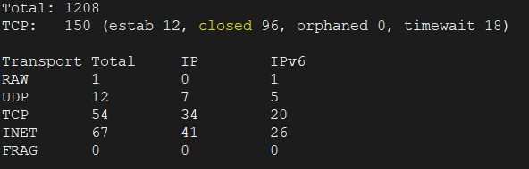
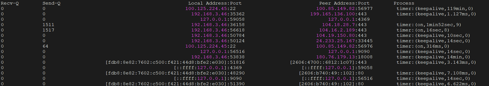

## 一、ss优势

想想当时刚学会用 `netstat` 的时候，一手命令开始查进程连接、找端口，当时觉得这个工具已经无法被替代了，但是紧跟着业务场景的丰富，它也处于被淘汰的边缘了。

在一般的轻量级应用服务器上，使用 `netstat` 还是很犀利的，但是在高并发服务器上，服务多、连接多导致 `netstat` 慢到卡顿。其官方就推出了一款属于 iproute2 工具集的 `ss` ，作为 `netstat` 的替代品。

`ss` （Socket Statistics）可以做到直接读取内核netlink信息，毫秒级输出，支持精细化过滤、状态统计、进程关联，已经成为了现代linux运维必备的网络排查利器。

| 特性     | ss                            | netstat                     |
| -------- | ----------------------------- | --------------------------- |
| 执行速度 | 高并发秒出                    | 遍历/proc，连接多会导致卡顿 |
| 数据来源 | 内核netlink直接读取           | 解析/proc/net/tcp等文件     |
| 过滤能力 | 支持/ip/端口/进程组合过滤     | 依赖grep/awk二次筛选        |
| 信息维度 | 定时器、tcp内部信息、内存统计 | 仅基础连接信息              |
| 默认安装 | CentOS7+/Ubuntu16+预装        | 新版本系统已逐步移除        |

首先介绍一下Linux中的两类用户，一种是超级用户（root），另外一种是普通用户。在管理一台服务器时，我们通常不会使用root去执行操作，因为root用户具有很大的权限，可能会执行一些危险的命令，导致服务器崩溃。然而，在运维过程中我们可能需要执行一些系统管理任务，我们通常会使用sudo来执行这些命令。

线上服务器排查网络，优先用 `ss`，后续新的linux版本会逐步淘汰 `netstat`

## 二、ss核心参数

基础格式：

```shell
ss [选项] [过滤条件]
```

- -t/-u: 仅显示TCP/UDP连接
- -l: 只看监听中端口（服务是否启动）
- -a: 显示所有套接字（监听+已建立+关闭中）
- -n: 禁用域名/服务名解析，纯数字输出，最快
- -p: 显示关联进程 PID / 进程名（需root权限）
- -s: 输出连接统计摘要（总连接、各状态数量）
- -o: 显示TCP定时器（排查超时、长连接）
- -i: 显示TCP内部信息（拥塞、重传、滑动窗口）
- -m: 显示socket内存使用
- -4/-6: 仅IPv4 / IPv6 连接
- -x: 显示UNIX

## 三、ss高级用法

`ss` 原生支持状态、IP、端口、逻辑组合过滤，不用管道也能精准排查，这是最核心的高级能力。

### 1. 按TCP状态过滤

支持所有TCP状态：established、syn-sent、syn-recv、fin-wait-1、fin-wait-2、time-wait、close-wait、last-ack、listening。

```shell
#查看所有已建立的tcp连接
ss -t state established
#查看time-wite连接（排查端口耗尽）
ss -t state time-wait
#查看close-wait连接（服务未正常关闭连接，必查）
ss -t state close-wait
#查看tcp监听端口
ss -t state listening
```

### 2. 按端口过滤

运算符：`==` / `!=` / `gt`(>) / `lt` (<) / `ge` (>=) / `le` (<=)

```shell
#目标端口为8080/443的tcp连接
ss -lt dport == :80
ss -lt dport == :443
#源端口为22的连接（本机对外ssh）
ss -lt sport == :22
#源端口 > 1024 的临时端口连接
ss -lt sport gt :1024
#组合：80 端口已建立连接
ss -t state established '( dport == :80 or sport == :80 )'
```

### 3. 按ip过滤（指定客户端/服务端ip）

```shell
#目标IP为192.168.2.10的所有连接
ss dst 192.168.2.10
#源IP为 10.0.0.0/24 网段的连接
ss src 10.0.0.0/24
#组合：特定ip访问 3306 端口
ss -tn dst 192.168.2.105 dport == :3306
```

### 4. UNIX域套接字过滤（本地进程通信）

```shell
#查看mysql本地套接字连接，排查本地程序通过sock文件连接mysql（不走端口号）
ss -x src /var/run/mysqld/mysqld.sock
#查看X11相关本地连接（图形化）
ss -x src /tmp/.X11-unix/*
```

## 四、ss实战场景：线上问题排查定位

### 场景1. 快速定位端口占用（服务启动失败常用）

服务起不来，提示端口被占用，用 `ss` 快速定位占用端口进程：

```shell
# 查8080端口的占用进程（-n 数字， -l 监听，-p 进程）
ss -tlnp | grep :8080
```

### 场景2. 统计连接状态（判断服务器网络健康度）

不用 `awk` 统计，`-s` 直接输出总览，快速判断 time-wait/close-wait异常：

```shell
ss -s
```

输出结果如下：



输出解读：

- tcp总连接数，已连接、关闭、孤儿、timewait数量
- udp/raw/inet套接字统计
- timewait过多：调优tcp_tw_reuse/tcp_tw_recycle，后者仅用于旧版本内核
- closewait过多：应用未正常关闭连接，代码bug

### 场景3. 排查长连接/超时（看tcp定时器）

`-o` 显示定时器信息，排查心跳、超时、半连接问题：

```shell
ss -ton state established
```



### 场景4. TCP内部细节调优（拥塞、重传）

`-i` 输出tcp内部信息，适合网络性能调优：

```shell
ss -ti state established
```

可查看：滑动窗口、拥塞控制算法、重传次数、RTT等。

这里需要对TCP协议有很深的理解，不然可能看不懂这些数据的含义，无法通过这些数据来判断网络是否处于正常状态。

### 场景5. 统计高并发连接数

结合`awk`快速统计单ip连接数，排查恶意访问：

```shell
ss -tn state established | awk '{ print $4 }' | cut -d: -f1 | sort | uniq -c | sort -nr
```

如何理解这个连续用了多个管道的命令呢？比较原始的办法是不断去添加管道，比如：

```shell
ss -tn state established
ss -tn state established | awk '{ print $ 4}'
ss -tn state established | awk '{ print $ 4}' | cut -d: f1
ss -tn state established | awk '{ print $ 4}' | cut -d: f1 | sort
ss -tn state established | awk '{ print $ 4}' | cut -d: f1 | sort | uniq -c
ss -tn state established | awk '{ print $ 4}' | cut -d: f1 | sort | uniq -c | sort -nr
```

这样执行下来，可以清晰看到输入管道和管道输出的内容，可以快速整明白每个命令的作用。

需要注意的是，`uniq -c` 这条命令可以去重并统计数量，但并非全文统计，而是比较两个相邻的行是否重复，因此需要在进入这个管道之前，再过一个`sort`管道。

## 五、避坑要点

1. `-p`需要root权限，普通用户看不到进程名/pid
2. 优先用`-n`，不加会反向解析域名，大幅减慢速度，线上必加
3. tcp/udp分清楚，查udp必须加 `-u`，默认只显示 tcp
4. 状态拼写准确，time-wait、close-wait带横杠，不能写错
5. 过滤条件加引号，组合过滤（or/and）必须使用单引号包裹，避免shell解析错误

`ss`不是`netstat`的平替，而是升级款的更快、更准、更强大。掌握本文的高级过滤、状态排查、脚本化用法，线上端口占用、连接异常、高并发瓶颈，都能一键定位。